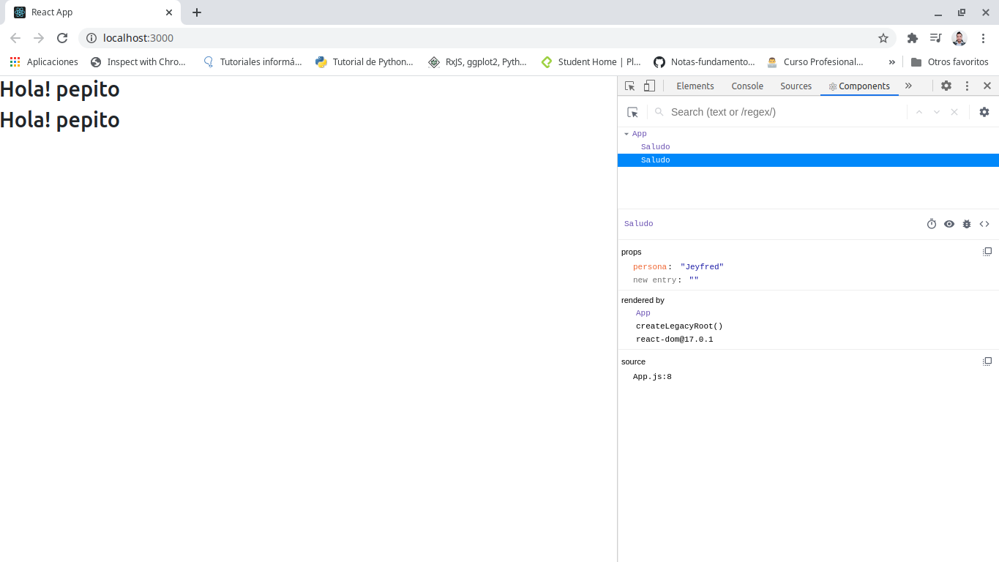
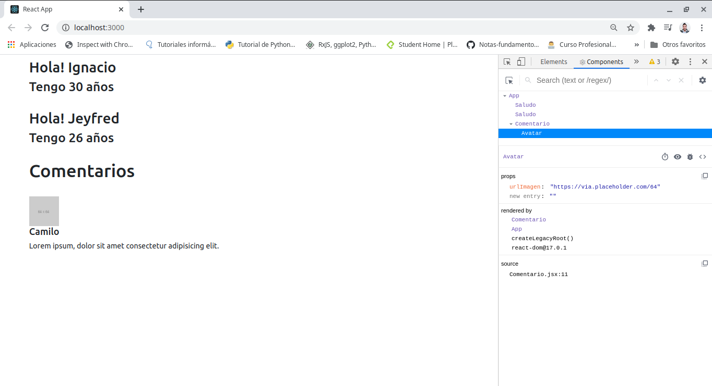

# React-Hooks-

## Tabla de contenido 

[Fundamentos Reactjs](#Fundamentos-Reactjs)

[JSX y Recorrer Arrays con Keys](#JSX-y-Recorrer-Arrays-con-Keys)

[Formularios onChange y onSubmit](#Formularios-onChange-y-onSubmit)

[React Hook Form](#React-Hook-Form)

[Práctica #1](#Práctica-1)

[Props en Componentes](#Props-en-Componentes)

[Aplicación CRUD](#Aplicación-CRUD)

[React Router Instalación y configuración de rutas](#React-Router-Instalación-y-configuración-de-rutas)

[]()

[]()

[]()

[]()

[]()

[]()

[]()

[]()

[]()

<div align="right">
  <small><a href="#tabla-de-contenido">🡡 volver al inicio</a></small>
</div>

## Fundamentos Reactjs


Para empezar a manejar React Hooks es necesario tener fundamentos de JavaScript.

Los Hooks son una nueva incorporación en React 16.8. Permiten usar estado y otras características de React sin escribir una clase.

Es necesario tener instalado [nodejs](https://nodejs.org/es/) en su versión actual o en la version LTS, es necesario instalarlo para hacer uso de **npm** que es el programa que ayuda a instalar dependencias

A continuación para empezar el proyecto se debe abrir la terminal y abrir la ubicación donde se va a instalar el proyecto por ejemplo esa carpeta se puede llamar proyectos React Hooks o el nombre que se desee en mi caso se llama React Hooks


A continuación ejecutar en la terminal el comando `npx create-react-app my-app` en este caso **my-app** va a ser el nombre de la aplicación o proyecto que se vaya a realizar y dentro de la carpeta **my-app** se van a crear todas las dependencias del proyecto.

En lo posible es mejor usar un editor de código como [Visual Studio Code](https://code.visualstudio.com/).

Después de realizar la instalación nuevamente en la terminal abrir la ubicación del proyecto que en este caso la nueva ruta es con la carpeta que se creo que es **my-app** y ejecutar el comando `code .` para abrir Visual Studio Code con las dependencias del proyecto


En la terminal ejecutar `npm start`, este comando lo que va a hacer es abrir un servidor en el navegador con el componente de react funcionando y girando sobre si mismo 


Los componentes son código de html y javascript, pero que se encuentran separados por ejemplo en la imagen a continuación cada componente representa un color distinto


En Visual Studio Code al abrir la carpeta instalada **my-app**, se encuentra varios archivos y carpetas 


Dentro de la carpeta **node_modules** estan los modulos de node que sirven para ejecutar todo el código

**public** es la carpeta donde están los archivos públicos que estan en el componente. Por ejemplo esta el archivo **index.html** donde esta tan solo una parte de lo que queremos que vea el cliente.

Lo mas importante del archivo index.html es lo que esta en el div con id root, dentro del div es donde van a estar todos los componentes y funcionalidad que se le quiera dar a la aplicación creada 


**src**(source) Donde estan todos los archivos que se van a trabajar para crear los componentes, el archivo **.gitignore** sirve para que cuando se vaya a subir un proyecto no suban algunos archivos que no queremos mostrar.

Uno de los archivos mas importantes que esta dentro de la carpeta **src** es **App.js** donde estan importados algunos archivos y librerías y ademas en este hay funciónes de JavaScript y código html


El renderizado por ejemplo del icono que se muestra cuando ejecutamos **npm start** es el icono de React que es un atomo. y este se esta representado entre llaves `{logo}`

Pero esto es solo un ejemplo que trae consigo el framework, para empezar a utilizarlo la estructura de **App.js** va a quedar de la siguiente forma

```
import React from 'react';

function App() {
  return (
    <div >

    </div>
  );
}

export default App;

```

Dentro del `<div></div>` agregar el primer Hola mundo React en una etiqueta h1

```
import React from 'react';

function App() {
  return (
    <div >
      <h1>Hola mundo React</h1>
    </div>
  );
}

export default App;

```

El servidor esta pendiente de cada cambio que se esta realizando mientras se este ejecutando en la terminal por tanto al revisar en navegador se va a desplegar **Hola mundo React** como se escribió en el archivo


Las extensiónes que se pueden instalar en Visual Studio Code son las siguientes:

- [Bracket Pair Colorizer](https://marketplace.visualstudio.com/items?itemName=CoenraadS.bracket-pair-colorizer)

- [ES7 React/Redux/React-Native/JS snippets](https://marketplace.visualstudio.com/items?itemName=dsznajder.es7-react-js-snippets)

- [generate-react-component](https://marketplace.visualstudio.com/items?itemName=joshjg.generate-react-component)

- [Prettier Formatter](https://marketplace.visualstudio.com/items?itemName=esbenp.prettier-vscode)

- [React/Redux/react-router Snippets](https://marketplace.visualstudio.com/items?itemName=discountry.react-redux-react-router-snippets)

- [Reactjs snippets](https://marketplace.visualstudio.com/items?itemName=xabikos.ReactSnippets)

- [Simple React Snippets](https://marketplace.visualstudio.com/items?itemName=burkeholland.simple-react-snippets)

Estos sirven para facilitar el manejo del código, mostrar errores con colores, sugerencias, autocompletado con comandos, etc.

Por el momento se pueden borar unos archivos que no se estan ocupando en el proyecto como por ejemplo App.css, logo.svg. 

A continuación dentro de la carpeta **src** crear una subcarpeta que tenga por nombre **components** la cual sera donde se van a crear cada uno de los componentes del proyecto, la carpeta se puede llamar de cualquier otra forma, pero el Framework sugiere que se llame de esta forma.

Dentro de esta carpeta crear un archivo que se llame **Contador.js** y se debe notar que los componentes la primer letra del archivo en mayúscula.

Dentro del archivo escribir **imr** que es la abreviacion de `import React from 'react'` y presionar con la tecla tab del teclado para que se auto complete, esto solo va a suceder si se instalaron las extensiónes anteriormente sugeridas.

**Nota:** cada vez que se cree un componente se debe importar react

si se escribe la abreviación **sfc** va a traer la estructura de la función que debe llevar el archivo y ahora escribir **Contador**


Dentro del return agregar un `<h3>` y entre sus etiquetas html escribir Mi primer componente

```
import React from 'react'

const Contador = () => {
    return ( 
        <h3>Mi primer componente</h3>
     );
}
 
export default Contador;
```

Para llamar al componente se debe utilizar en el archivo **App.js** y se debe importar con el nobre del archivo y la ubicación `import Contador from './components/Contador'`

para utilizar el componente se debe traer como una especie de html dentro del return asi `<Contador />`

```
import React from 'react';
import Contador from './components/Contador'

function App() {
  return (
    <div >
      <h1>Hola mundo React</h1>
      <Contador/>
    </div>
  );
}

export default App;

```

Visualizar nuevamente el navegador y a continuación se ve el componente funcionando


A partir de este momento se va a empezar a hacer uso de los Hooks. Que permiten usar estados y otras caracterisiticas de React sin escribir una clase.

El estado son datos que se pueden manipular, para hacer uso del estado importándolo con react entre llaves {useState}.

En el componente Contador se va hacer uso del estado para eso se importa `import React, {useState} from 'react'`

Ahora antes del `return` va a estar toda la lógica que se requiera hacer para la aplicación y dentro de este se va hacer uso del estado

para esto se crea una constante que se hace = al useState y también otra que se llame Contador que va a contener un Arrow Function.

Lo que va dentro de las llaves cuadradas [] es el nombre del estado y luego se coloca generalmente set y el nombre del estado, este servira para modificar en este ejemplo el numero

Dentro de los paréntesis del `useState()` se va a dar el valor inicial del estado, el cual puede recibir cualquier tipo de dato, como un numero, un booleano, un array, un objeto, etc.

```
import React, {useState} from 'react'

const Contador = () => {

    const [numero, setNumero] = useState(0);

    return ( 
        <h3>Mi primer componente</h3>
     );
}
 
export default Contador;
```

para llamar el estado en este caso, o cualquier valor que venga de JavaScript se coloca el nombre entre corchetes `{numero}`

```
import React, {useState} from 'react'

const Contador = () => {

    const [numero, setNumero] = useState(1);

    return ( 
        <h3>Mi {numero}} componente</h3>
     );
}
 
export default Contador;
```

automáticamente este se va a renderizar en el navegador


y si se coloca un string en el state también se va a renderizar en el navegador 

```
import React, {useState} from 'react'

const Contador = () => {

    const [numero, setNumero] = useState('primer');

    return ( 
        <h3>Mi {numero} componente</h3>
     );
}
 
export default Contador;
```


`setNumero` va a servir para modificar el estado. El ejemplo sera que un usuario haga clic sobre un botón y los números empiecen a cambiar, presiona 0, presiona 1, presiona 2, etc.

para esto debajo del h3 se crea una etiqueta de botón que se llame Aumentar 

```
import React, {useState} from 'react'

const Contador = () => {

    const [numero, setNumero] = useState('primer');

    return ( 
        <h3>Mi {numero} componente</h3>
        <buttton>Aumentar<button>
     );
}
 
export default Contador;
```

Al renderizar esto, la pagina muestra un error


y es porque react tiene la filosofía de renderizar un solo componente, para que no ocurra un error la etiqueta h3 y button se debe envolver en un div padre 

```
import React, {useState} from 'react'

const Contador = () => {

    const [numero, setNumero] = useState('primer');

    return ( 
        <div>
            <h3>Mi {numero} componente</h3>
            <button>Aumentar</button>
        </div>
     );
}
 
export default Contador;
```

De esta forma ya se va a renderizar el componente en el navegador


Existe otra alternativa a usar diferente al div y se llama `Fragment`, este se debe importar junto con useState entre corchetes `{useState, Fragment}` y posteriormente se reemplazan en este caso por los `div`

```
import React, {useState, Fragment} from 'react'

const Contador = () => {

    const [numero, setNumero] = useState('primer');

    return ( 
        <Fragment>
            <h3>Mi {numero} componente</h3>
            <button>Aumentar</button>
        </Fragment>
     );
}
 
export default Contador;
```

De esta forma se va a seguir renderizando de la misma forma


Ahora se va a dar funcionalidad al botón con un `onclick={}` el cual al escuchar el click va a empezar aumentar de 1 en 1, lo que va dentro de los corchetes sera una función o lo que se desee.

La función se va a crear con una constante que se va a llamar aumentar y esta va a contener un Arrow Function 

```
import React, {useState, Fragment} from 'react'

const Contador = () => {

    const [numero, setNumero] = useState('primer');

    const aumentar = () => {
        
    }

    return ( 
        <Fragment>
            <h3>Mi {numero} componente</h3>
            <button onClick={ }>Aumentar</button>
        </Fragment>
     );
}
 
export default Contador;
```

y ahora para ver como esta funcionando se puede hacer un `console.log(Estoy haciendo click)` y agregar la función al `onClick={aumentar}`.

```
import React, {useState, Fragment} from 'react'

const Contador = () => {

    const [numero, setNumero] = useState('primer');

    const aumentar = () => {
        console.log('Estoy haciendo click')
    }

    return ( 
        <Fragment>
            <h3>Mi {numero} componente</h3>
            <button onClick={ aumentar }>Aumentar</button>
        </Fragment>
     );
}
 
export default Contador;
```

Para poder ver que este funcionando dar clic derecho sobre el navegador, hacer clic donde diga inspeccionar elemento y ubicarse en la pestaña consola o también se puede usar con el teclado **Ctrl + shift + j** después de tener abierta la consola, hacer clic varias veces sobre el botón aumentar y como se observa en el costado derecho de la pantalla aparece que di click 11 veces


Para añadir funcionalidad ahora si se agrega setNumero para empezar a cambiar de 1 en 1, si se coloca `numero +1`, por si solo el navegador va a arrojar un error porque para eso recomienda hacer uso de en este caso el método o la función que va a hacer el cambio de estado `setNumero(numero +1)`

```
import React, {useState, Fragment} from 'react'

const Contador = () => {

    const [numero, setNumero] = useState(0);

    const aumentar = () => {
        console.log('Estoy haciendo click')
        setNumero(numero +1);
    }

    return ( 
        <Fragment>
            <h3>Mi {numero} componente</h3>
            <button onClick={ aumentar }>Aumentar</button>
        </Fragment>
     );
}
 
export default Contador;
```


<div align="right">
  <small><a href="#tabla-de-contenido">🡡 volver al inicio</a></small>
</div>

## JSX y Recorrer Arrays con Keys

**JSX**

La presentación del siguiente bloque de código no se que conoce como un string o un html

`const element = <h1>Hello, world!</h1>;`

Se llama JSX y es una extensión de la sintaxis de JavaScript el cual es lo recomendable para usar con React para describir como debería ser la interfaz de usuario. JSX puede recordar a un lenguaje de plantilla, pero viene con JavaScript.

A continuación se van a modificar los elementos del capitulo pasado.

En la carpeta components crear un archivo llamado **Jsx.js** y dentro de este archivo hacer la construcción básica del componente

```
import React from 'react'

const Jsx = () => {
    return (  );
}
 
export default Jsx;
```

Dentro de la estructura de este podemos hacer una condición con un if ternario para esto pintamos un h2 preguntando Frio o Calor  en h4 la condición `temperatura > 20 ? 'Calor' : 'Frio`, esta expresión esta preguntando. Si la temperatura es mayor a 20 entonces imprima Calor si es verdadera la condición de lo contrario es decir si es menos imprima Frio. Y todo esto de cumple dada una condición que la agregamos antes del return creando una constante que se llama temperatura

**Nota:** Recordar que como React trabaja con los componentes y para tener toda su estructura debe estar dentro de Fragment importándolo con la librería o usar contenedores div

```
import React, {Fragment}from 'react'

const Jsx = () => {

    const temperatura = 21;

    return ( 
        <Fragment>
        <h2>Frio o Calor?</h2>
        <h4>
            {
                temperatura > 20 ? 'Calor' : 'Frio'
            }
        </h4>
        </Fragment>
     );
}
 
export default Jsx;
```

Para hacer uso del componente ahora pasamos a **App.js**, y lo importamos para luego imprimirlo en el navegador. En este capitulo ya no vamos a hacer uso del componente Contador, motivo por el cual no se presenta en este documento

```
import React from 'react';
import Jsx from './components/Jsx'

function App() {
  return (
    <div >
      <Jsx/>
    </div>
  );
}

export default App;

```

Recordando que la condición es mayor a 20 entonces en el navegador debe aparecer la palabra Calor 


A continuación vamos a crear un nuevo componente el cual se llamara **Lista.js** la cual se utilizara para crear un arreglo y recorrerlo haciendo uso de useState. Recordando que se establece la estructura básica utilizando abreviaciones como **imr** y **sfc** para auto completar esta sintaxis

```
import React from 'react'

const  = () => {
    return (  );
}
 
export default ;
```

A continuación hacemos el llamado de useState y de fragment para poder usar cada uno de ellos en sus respectivos sitios.

creamos una constante donde el estado se llama arrayNumero, y el modificador setArrayNumero y su estado se inicializa con un array que recibe números, los cuales cuando usemos el método map, cada uno de estos números se van a representar como un ítem.

Después para nombrar este ejercicio encerramos la palabra Lista dentro de un h2 y a continuación utilizamos el estado para recorrerlo con el método map y después retornarlo en una lista entre etiquetas de párrafo

```
import React, {useState, Fragment} from 'react'

const Lista = () => {

    const [arrayNumero, setArrayNumero] = useState([1, 2, 3, 4, 5, 6]);

    return ( 
        <Fragment>
        <h2>Lista</h2>
        {
            arrayNumero.map((item) => 
            <p>{item}</p>)
        }
        </Fragment>
     );
}
 
export default Lista;
```

Ahora lo importamos dentro del archivo **App.js** y lo utilizamos como otro componente debajo de Jsx

```
import React from 'react';
import Jsx from './components/Jsx'
import Lista from './components/Lista'

function App() {
  return (
    <div >
      <Jsx/>
      <Lista/>
    </div>
  );
}

export default App;

```

De esta forma visualizamos en el navegador ambos componentes y el recorrido que hizo el método map implementado en el componente de Lista


Al abrir la consola con **ctrl + shift +j**, esta informando sobre un error que al usar el método map esta obligado a pasar un segundo parámetro que acompaña a cada numero del recorrido el cual es 0 y se va a representar como index.

Ademas de esto antes de cerrar la primer etiqueta p se debe llamar el atributo key y pasar como parámetro a index también.

De esta forma, si en vez de empezar en 1, el array comenzara en 0 se imprimirían valores como (0,0, 1,1, 2,2, 3,3, 4,4, 5,5, 6,6)

Cuando lo visualicen en el navegador lo van a comprender mejor

```
import React, {useState, Fragment} from 'react'

const Lista = () => {

    const [arrayNumero, setArrayNumero] = useState([1, 2, 3, 4, 5, 6]);

    return ( 
        <Fragment>
        <h2>Lista</h2>
        {
            arrayNumero.map((item, index) => 
            <p key={index}>{item} - {index}</p>)
        }
        </Fragment>
     );
}
 
export default Lista;
```


Lo único que se ve ahora del lado derecho, en la consola es una advertencia que indica que no se esta haciendo uso de setArrayNumero

A continuación vamos a hacer uso del modificador pero antes de eso vamos a añadir un evento onClick en un botón que vamos a crear debajo de la lista y se va a llevar por nombre la palabra agregar elemento

```
import React, {useState, Fragment} from 'react'

const Lista = () => {

    const [arrayNumero, setArrayNumero] = useState([1, 2, 3, 4, 5, 6]);

    return ( 
        <Fragment>
        <h2>Lista</h2>
        <button onClick={agregarElemento} >Agregar elemento</button>
        {
            arrayNumero.map((item, index) => 
            <p key={index}>{item} - {index}</p>)
        }
        </Fragment>
     );
}
 
export default Lista;
```

Si se deja de esta forma por el momento el navegador mostrara un error porque no se esta haciendo nada con el evento que se esta declarando que es el que esta entre `{agregarElemento}`


Para dejar de ver esto error hay que agregar funcionalidad mediante una constante que se llame agregar elemento y se pase un arrow function que escuche el evento.

A continuación como se va a dar uso del modificador se debe tener en cuenta que el estado inicial se declaro como un array, por tal motivo el modificador también debe ser un array que en un principio va a recibir el numero 7

```
import React, {useState, Fragment} from 'react'

const Lista = () => {

    const [arrayNumero, setArrayNumero] = useState([1, 2, 3, 4, 5, 6]);

    const agregarElemento = () => {
        console.log('click')
        setArrayNumero([7])
    }

    return ( 
        <Fragment>
        <h2>Lista</h2>
        <button onClick={agregarElemento} >Agregar elemento</button>
        {
            arrayNumero.map((item, index) => 
            <p key={index}>{item} - {index}</p>)
        }
        </Fragment>
     );
}
 
export default Lista;
```

El navegador se va a presentar con la lista de arreglos a continuación


pero al dar click sobre el botón agregar elemento esta lista cambio por 7,0. y entonces lo que sucede es que se pierde el estado inicial que es la lista


para corregir este error se va a hacer uso del operador de propagacion **(...)**, el cual esta representado por 3 puntos, este operador sirve en este caso para concatenar 2 arreglos como el ejemplo a continuación

`const a = [1,2,3]`
`const b = [4,5,6]`

para declararlos de una manera mas simple se crea una constante c de esta forma y se concatena todo en un solo array

`const c = [...a, ...b]`

`console.log(c)`


Continuando con el ejemplo y habiendo visto el concepto del operador de propagacion se va a hacer uso de este para concatenarlo con el numero 7 y presentarlo debajo del resto de la lista al hacer click sobre el botón Agregar elemento

```
import React, {useState, Fragment} from 'react'

const Lista = () => {

    const [arrayNumero, setArrayNumero] = useState([1, 2, 3, 4, 5, 6]);

    const agregarElemento = () => {
        console.log('click')
        setArrayNumero([
            ...arrayNumero,
            7
        ])
    }

    return ( 
        <Fragment>
        <h2>Lista</h2>
        <button onClick={agregarElemento} >Agregar elemento</button>
        {
            arrayNumero.map((item, index) => 
            <p key={index}>{item} - {index}</p>)
        }
        </Fragment>
     );
}
 
export default Lista;

```

y como resultado obtenemos primero la lista normal


Después hacemos click y obtenemos debajo el 7


y si seguimnos dando click sobre el botón va a continuar imprimiendose el 7 pero cambiando su llave


A continuación ahora la función se va a volver mas dinamica para imprimir o continuar con el resto de numeros Después del 7

para esto se va a crear un nuevo estado que va a recibir a numero y a setNumero y como el numero con el que queremos continuar dinamicamente lo vamos a inicializar con el numero 7 y lo llamamos en la función agregarElemento para poderlo usar e imprimirlo como el estado

```
import React, {useState, Fragment} from 'react'

const Lista = () => {

    const [arrayNumero, setArrayNumero] = useState([1, 2, 3, 4, 5, 6]);

    const [numero, setNumero] = useState(7)

    const agregarElemento = () => {

        setNumero(numero + 1)

        setArrayNumero([
            ...arrayNumero,
            numero
        ])
    }

    return ( 
        <Fragment>
        <h2>Lista</h2>
        <button onClick={agregarElemento} >Agregar elemento</button>
        {
            arrayNumero.map((item, index) => 
            <p key={index}>{item} - {index}</p>)
        }
        </Fragment>
     );
}
 
export default Lista;

```

Nuevamente revisamos el navegador y tenemos una lista inicial


y con el botón agregar elemento continuamos imprimendo numeros distintos


<div align="right">
  <small><a href="#tabla-de-contenido">🡡 volver al inicio</a></small>
</div>

## Formularios onChange y onSubmit

En este capitulo veremos lo que son los Formularios.

Nuevamente dentro de la carpeta components crear un archivo que se llame **Formulario.js** y construir la estructura básica con los comando **imr** y **sfc**

```
import React from 'react'

const Formulario = () => {
    return (  );
}
 
export default Formulario;
```

dentro del return crear una etiqueta h1 que lleve por nombre Formulario.

A continuación pasar a **App.js** y ya no se van a utilzar los archivos de la clase anterior entonces solamente importamos lo que necesitamos, que es el componente de Formulario

```
import React from 'react';
import Formulario from './components/Formulario'


function App() {
  return (
    <div >
      <Formulario/>
    </div>
  );
}

export default App;

```

y obtenemos el render en el navegador del componente Formulario


Para este capitulo se va hacer uso de [Bootstrap](https://getbootstrap.com/). Si no hay conocimiento de este pueden ver videos para aprender en el siguiente [enlace](https://www.youtube.com/watch?v=z7ecV0tL1Gg&ab_channel=Bluuweb%21).

Lo que se hace es importar el cdn que se encuentra en la pagina de Bootstrap y a continuación, abrir la carpeta **public** del proyecto y copiar este cdn en el archivo **index.html** como se muestra en la imagen a continuación 

```
<link href="https://cdn.jsdelivr.net/npm/bootstrap@5.0.0-beta1/dist/css/bootstrap.min.css" rel="stylesheet" integrity="sha384-giJF6kkoqNQ00vy+HMDP7azOuL0xtbfIcaT9wjKHr8RbDVddVHyTfAAsrekwKmP1" crossorigin="anonymous">
```


Al guardar los cambios ya se obtendra un cambio en los estilos del navegador y el titulo de Formulario se presentara de una manera distinta


para empezar a obtener otro tipo de cambios se agregan clases a las etiquetas con el keyword `className`. si estuviera trabajando con html puro se usaria el keyword `class`, y esto es una de las diferencias que proporciona React. Para centrar mas el contenido y tener un margen top de 5, escribimos a continuación de la etiqueta div del archivo **App.js** las propiedades del contenedor con un `className="container mt-5"`

```
import React from 'react';
import Formulario from './components/Formulario'


function App() {
  return (
    <div className="container mt-5" >
      <Formulario/>
    </div>
  );
}

export default App;

```

Para empezar a trabajar con el componente nuevamente abrimos el archivo **Formulario.js**, importamos `{Fragment, useState}` y a continuación de la etiqueta h1 agregamos una etiqueta Form y Después los input

```
import React, {Fragment, useState} from 'react'

const Formulario = () => {
    return ( 
        <Fragment>
            <h1>Formulario</h1>
            <form className="row">
                <div className="col-md-3">
                    <input
                        placeholder="Ingrese nombre">
                    </input>
                </div>
                <div className="col-md-3">
                    <input
                        placeholder="Ingrese apellido"></input>
                </div>
                <div className="col-md-3">
                    <button>Enviar</button>
                </div>
            </form>
        </Fragment>
     );
}
 
export default Formulario;
```

De momento el render en el navegador se ve de la siguiente forma y esto obliga a que se debe mejorar el diseño y hacer uso de los estilos de Bootstrap


A continuación se agregan las clases al formulario a los input y al botón para que se presenten de una forma visual mas agradable

```
import React, {Fragment, useState} from 'react'

const Formulario = () => {
    return ( 
        <Fragment>
            <h1>Formulario</h1>
            <form className="row">
                <div className="col-md-3">
                    <input
                        placeholder="Ingrese nombre"
                        className="form-control"
                        type="text">
                    </input>
                </div>
                <div className="col-md-3">
                    <input
                        placeholder="Ingrese apellido"
                        className="form-control"
                        type="text">
                    </input>
                </div>
                <div className="col-md-3">
                    <button className="btn btn-primary" type="submit">Enviar</button>
                </div>
            </form>
        </Fragment>
     );
}
 
export default Formulario;
```


Ahora cada input se va a relacionar con algun Hook y para eso vamos a hacer uso de useState antes del return y creamos el estado el cual se va a llamar datos y su modificador sera setDatos y el estado se va a inicializar con un objeto `{}` el cual se va a inicializar con un nombre y un apellido vacio

```
{
  nombre : '',
  apellido: '',
}
```

Ahora se debe relacionar cada uno de los input con cada objeto por tal motivo es recomendable que en los input se agregue el atributo name y tengan los mismos nombres de estos objetos como se ve a continuación

```
import React, {Fragment, useState} from 'react'

const Formulario = () => {

    const [datos, setDatos] = useState({
        nombre: '',
        apellido: '',
    })

    return ( 
        <Fragment>
            <h1>Formulario</h1>
            <form className="row">
                <div className="col-md-3">
                    <input
                        placeholder="Ingrese nombre"
                        className="form-control"
                        type="text"
                        name="nombre">
                    </input>
                </div>
                <div className="col-md-3">
                    <input
                        placeholder="Ingrese apellido"
                        className="form-control"
                        type="text"
                        name="apellido">
                    </input>
                </div>
                <div className="col-md-3">
                    <button className="btn btn-primary" type="submit">Enviar</button>
                </div>
            </form>
        </Fragment>
     );
}
 
export default Formulario;
```

**Nota:** El escribir los mismos nombres que tiene el objeto en los atributos de cada input no significa que esten conectados de alguna forma, pero es uno de los primeros pasos a establecer y sirve para que mas adelante se vea la funcionalidad de esto

___

Al utilizar google Chrome hay una herramienta de los devTools que se llama Components y de esta forma se pueden ver los componentes de nuestra aplicación en el navegador, para instalarlo pueden seguir al siguiente [enlace](https://chrome.google.com/webstore/detail/react-developer-tools/fmkadmapgofadopljbjfkapdkoienihi?hl=es).


Ahora se va hacer uso del evento **onChange** que va a estar en los atributos del input, el cual estara pendiente de los cambios que se vayan registrando y dentro de este va a tener una función la cual se puede llamar de cualquier forma pero para esta ocasion se llamara handleInputChange `onChange={handleInputChange}` y ahora se debe crear la función en la parte del JavaScript el cual ira de la siguiente forma

`const handleInputChange = () => {}}`, como esta es una función que esta a la escucha de un evento entre los paréntesis se coloca la palabra event o la que se considere conveniente, esto se hace por que es una convención del lenguaje.

Dentro de este evento se va a agregar un console.log que dice funcioná!

```
import React, {Fragment, useState} from 'react'

const Formulario = () => {

    const [datos, setDatos] = useState({
        nombre: '',
        apellido: '',
    })

    const handleInputChange = (event) => {
        console.log("funcióna!")
    }

    return ( 
        <Fragment>
            <h1>Formulario</h1>
            <form className="row">
                <div className="col-md-3">
                    <input
                        placeholder="Ingrese nombre"
                        className="form-control"
                        type="text"
                        name="nombre"
                        onChange={handleInputChange}>
                    </input>
                </div>
                <div className="col-md-3">
                    <input
                        placeholder="Ingrese apellido"
                        className="form-control"
                        type="text"
                        name="apellido"
                        onChange={handleInputChange}>
                    </input>
                </div>
                <div className="col-md-3">
                    <button className="btn btn-primary" type="submit">Enviar</button>
                </div>
            </form>
        </Fragment>
     );
}
 
export default Formulario;
```

Ahora al guardar los cambios verificar la consola del navegador y escribir algo sobre los campos de ambos formularios para verificar como en la consola se esta imprimiendo con cada letra que colocamos la palabra funcióna!


Ahora en el console.log cambiar `"funcióna!"` por `event.target.value` el cual va a detectar el valor que coloquemos en cada input

**Nota:** si en vez de haber pasado la palabra event como parámetro pasaron otra por ejemplo `pepito` entonces colocar `pepito.target.value`

y como se ve a continuación cada letra escrita la esta tomando esta propiedad


Ahora hay que hacer uso del modificador setDatos y a continuación del console.log se establece setDatos. Se debe tener en cuenta que el operador de propagación **...**, hace una copia de los datos y concatena. Entonces utilizamos junto con este operador la propiedad para establecer el nombre y el apellido, en este momento es cuando se relaciona el atributo name que se le dio a cada input y que es igual a los nombres que contiene el objeto del valor inicial del estado

```
        setDatos({
            ...datos,
            [event.target.name] : event.target.value
        }
```

```
import React, {Fragment, useState} from 'react'

const Formulario = () => {

    const [datos, setDatos] = useState({
        nombre: '',
        apellido: '',
    })

    const handleInputChange = (event) => {
        console.log(event.target.value)
        setDatos({
            ...datos,
            [event.target.name] : event.target.value
        }
        )
    }

    return ( 
        <Fragment>
            <h1>Formulario</h1>
            <form className="row">
                <div className="col-md-3">
                    <input
                        placeholder="Ingrese nombre"
                        className="form-control"
                        type="text"
                        name="nombre"
                        onChange={handleInputChange}>
                    </input>
                </div>
                <div className="col-md-3">
                    <input
                        placeholder="Ingrese apellido"
                        className="form-control"
                        type="text"
                        name="apellido"
                        onChange={handleInputChange}>
                    </input>
                </div>
                <div className="col-md-3">
                    <button className="btn btn-primary" type="submit">Enviar</button>
                </div>
            </form>
        </Fragment>
     );
}
 
export default Formulario;
```

Ahora dirigir nuevamente a la pestaña de componentes de los devTools y desplegar en los hooks el nombre y el apellido para ver como cada componente esta obteniendo el estado de lo que escribimos en los campos del nombre y el apellido


Si se quiere imprimir el nombre de otra forma también debajo del cierre de la etiqueta forms se puede incluir una etiqueta h3 o de párrafo y llamar el nombre y el apellido entre `<h3>{datos.nombre} - {datos.apellido}</h3>`


Existe otro evento llamado onSubmit que ira directamente en el formulario y tendrá una función llamada `enviarDatos`, la cual que se tiene que construir en la parte del JavaScript, esta función también va a recibir como parámetro a `event` y este hace uso de un método que se llama `preventDefault()` que es como hacer un Get para obtener los datos y ahorrar pasos que obtienen el procesamiento de manera automática. Después de esto se hace un console.log de `datos.nombre` y `datos.apellido`.

```
import React, {Fragment, useState} from 'react'

const Formulario = () => {

    const [datos, setDatos] = useState({
        nombre: '',
        apellido: '',
    })

    const handleInputChange = (event) => {
        // console.log(event.target.value)
        setDatos({
            ...datos,
            [event.target.name] : event.target.value
        }
        )
    }

    const enviarDatos = (event) => {
        event.preventDefault();
        console.log(datos.nombre + ' ' + datos.apellido)
    }

    return ( 
        <Fragment>
            <h1>Formulario</h1>
            <form className="row" onSubmit={enviarDatos}>
                <div className="col-md-3">
                    <input
                        placeholder="Ingrese nombre"
                        className="form-control"
                        type="text"
                        name="nombre"
                        onChange={handleInputChange}>
                    </input>
                </div>
                <div className="col-md-3">
                    <input
                        placeholder="Ingrese apellido"
                        className="form-control"
                        type="text"
                        name="apellido"
                        onChange={handleInputChange}>
                    </input>
                </div>
                <div className="col-md-3">
                    <button className="btn btn-primary" type="submit">Enviar</button>
                </div>
            </form>
            <h3>{datos.nombre} - {datos.apellido}</h3>
        </Fragment>
     );
}
 
export default Formulario;

```

Este evento ayuda a que cuando demos click sobre el botón enviar, la consola capture los datos que le ingresemos


<div align="right">
  <small><a href="#tabla-de-contenido">🡡 volver al inicio</a></small>
</div>

## React Hook Form

Esta es una extensión que ayuda a realizar formularios de una manera mas sencilla y que se encuentra en el siguiente [enlace](https://react-hook-form.com/get-started), donde se puede seguir toda la documentacion 

En la parte donde dice comenzar ahora esta el comando para instalar esta extensión en nuestro proyecto.


Recordar que se debe estar en la ubicacion del proyecto en la terminal y ejecutar el siguiente comando para realizar la instalacion

`npm install react-hook-form`

A continuación crear un nuevo componente que conecte con **App.js**, el componente nombrarlo como **FormHook.js** y en **App.js** llamar solo al nuevo componente creado el cual queda asi 

```
import React, {Fragment} from 'react'

const FormHook = () => {
    return ( 
        <Fragment>
            <h1>Formulario</h1>
        </Fragment> 
     );
}
 
export default FormHook;
```

**App.js**

```
import React from 'react';
import FormHook from './components/FormHook'

function App() {
  return (
    <div>
      <FormHook/>
    </div>
  );
}

export default App;

```

Para empezar se va a generar un input y un botón de una forma sencilla en el archivo **FoormHook.js**, aprovechando que ya esta instalado el cdn de Bootstrap y generar unas clases para presentar visualmente el componente de una forma mas agradable

```
import React, {Fragment} from 'react'

const FormHook = () => {
    return ( 
        <Fragment>
            <h1>Formulario</h1>
            <form>
                <input
                name="titulo"
                className="form-control my-2"
                />
                <button className="btn btn-primary" >Enviar</button>
            </form>
        </Fragment> 
     );
}
 
export default FormHook;
```

al ejecutar npm start esto es lo que se debe ver en el navegador


Lo primero que se debe tener en cuenta para hacer uso de la librería que proporciona los Hook Form es que se debe importar al componente `import {useForm} from 'react-hook-form'`, esta librería servirá para realizar validaciónes y va hacer uso de un registro, un error y la función que sera handleSubmit `const {register, errors, handleSubmit} = useForm();`

```
import React, {Fragment} from 'react'

import {useForm} from 'react-hook-form'


const FormHook = () => {
    const {register, errors, handleSubmit} = useForm();
    
    return ( 
        <Fragment>
            <h1>Formulario</h1>
            <form>
                <input
                name="titulo"
                className="form-control my-2"
                />
                <button className="btn btn-primary" >Enviar</button>
            </form>
        </Fragment> 
     );
}
 
export default FormHook;
```

La forma en que trabaja la función handleSubmit para hacer las validaciónes es que se debe generar dentro de la etiqueta form un onSubmit que contenga a la función handleSubmit y que este nuevamente haga uso de la función onSubmit `<form onSubmit={handleSubmit(onSubmit)}>`, nuevamente como en el capitulo anterior es muy importante tener el atributo name dentro de un input y por esta razón anteriormente ya se coloco este atributo name con el nombre de titulo.

Al realizar esto antes del return se puede crear una función onSubmit pasando como parámetro data y luego hacer un console.log para ver que esta recibiendo la data

```
import React, {Fragment} from 'react'

import {useForm} from 'react-hook-form'


const FormHook = () => {
    const {register, errors, handleSubmit} = useForm();

    const onSubmit = (data) => {
        console.log(data)
    }

    return ( 
        <Fragment>
            <h1>Formulario</h1>
            <form onSubmit={handleSubmit(onSubmit)}>
                <input
                name="titulo"
                className="form-control my-2"
                />
                <button className="btn btn-primary" >Enviar</button>
            </form>
        </Fragment> 
     );
}
 
export default FormHook;
```

Ademas de esto dentro de los atributos se puede llamar a register para hacer todas las validaciónes necesarias utilizándolo de esta forma

`ref = {register}`

en el register se pasa un objeto que reciba varios parámetros como por ejemplo que el campo sea requerido utilizando `required: {value:true}` y también desplegar un mensaje de error sobre el campo si el usuario no pasa un valor de titulo, de esta forma queda asi 

```
ref={
    register({
        required: {value: true, message: 'Titulo obligatorio'}
    })
}
```

El archivo queda de esta forma

```
import React, {Fragment} from 'react'

import {useForm} from 'react-hook-form'


const FormHook = () => {
    const {register, errors, handleSubmit} = useForm();

    const onSubmit = (data) => {
        console.log(data)
    }

    return ( 
        <Fragment>
            <h1>Formulario</h1>
            <form onSubmit={handleSubmit(onSubmit)}>
                <input
                name="titulo"
                className="form-control my-2"
                ref={
                    register({
                        required: {value: true, message: 'Titulo obligatorio'}
                    })
                }
                />
                <button className="btn btn-primary" >Enviar</button>
            </form>
        </Fragment> 
     );
}
 
export default FormHook;
```

En el navegador se debe abrir la consola para observar que esta pasando, si se pasa al campo del titulo por ejemplo un nombre o cualquier palabra al hacer clic al botón enviar, van a aparecer todos los datos que estamos pasando, esta es la importancia de las validaciónes y el uso de los atributos como `name` y `ref`, se pueden pasar mas validaciónes aqui una documentación practica de [Bluuweb](https://bluuweb.github.io/react-udemy/04-formularios/#react-hook-form) para hacer uso de esta librería


Para desplegar los errores se puede hacer uso de la etiqueta span con una clase bootstrap y hay 2 formas de hacer que esto se presente. usando Vanilla JavaScript o mediante los [Optional Chaining](https://developer.mozilla.org/es/docs/Web/JavaScript/Referencia/Operadores/Encadenamiento_opcional).

con esta expresión `{errors?.titulo?.message}` lo que se esta preguntando es. Existen errores (si/no), existen errores en el campo del titulo (si/no). si existe un error despliegue el mensaje que se registro con required

```
<span className="text-danger text-small d-block mb-2">
    {errors?.titulo?.message}
</span>
```

y el span se puede agregar debajo del input para desplegar el mensaje de error quedando de la siguiente forma

```
import React, {Fragment} from 'react'

import {useForm} from 'react-hook-form'


const FormHook = () => {
    const {register, errors, handleSubmit} = useForm();

    const onSubmit = (data) => {
        console.log(data)
    }

    return ( 
        <Fragment>
            <h1>Formulario</h1>
            <form onSubmit={handleSubmit(onSubmit)}>
                <input
                name="titulo"
                className="form-control my-2"
                ref={
                    register({
                        required: {value: true, message: 'Titulo obligatorio'}
                    })
                }
                />
                <span className="text-danger text-small d-block mb-2">
                    {errors?.titulo?.message}
                </span>
                <button className="btn btn-primary" >Enviar</button>
            </form>
        </Fragment> 
     );
}
 
export default FormHook;
```

Si a continuación se abre el navegador y se da clic sobre el botón enviar nada va a aparecer el mensaje de error


Si existieran mas etiquetas input, también habría que agregar las respectivas validaciónes para que al dar clic sobre el botón enviar tome toda la data.

Existe una propiedad adicional que sirve para limpiar los campos de los formularios es decir, actualmente se inserta una palabra sobre el campo pero no se limpia el formulario, toca borrar la palabra para insertar otra.

En la constante onSubmit se puede agregar un evento que permite realizarlo y asi es como se utiliza

```
const onSubmit = (data, e) => {
        console.log(data)
        e.target.reset()
    }
```

De tal forma que agregando esta nueva propiedad al código nuevamente en el navegador se inserta una palabra, se envia y se limpian los campos del formulario


Como se puede observar las palabras las recibio la consola pero no se quedaron sobre el campo para escribir

<div align="right">
  <small><a href="#tabla-de-contenido">🡡 volver al inicio</a></small>
</div>

## Práctica #1

Crear un nuevo componente que se llame **EjemploUno.js** con la estructura básica en el proyecto del curso.

Probar en el Return usando la etiqueta `Fragment` para ver si el editor lo importa solo y utilizar una etiqueta h1 que lleve por titulo Ejemplo 1

```
import React, { Fragment } from 'react'

const EjemploUno = () => {
    return ( 
        <Fragment>
            <h1>Ejemplo 1</h1>
        </Fragment>
     );
}
 
export default EjemploUno;
```

Dirigir a **App.js** e importar el componente sin los temas de los capítulos anteriores

```
import React from 'react';
import EjemploUno from './components/EjemploUno'

function App() {
  return (
    <div>
      <EjemploUno/>
    </div>
  );
}

export default App;

```

Verificar que este ejecutando en el navegador


Nuevamente se va a hacer uso de la librería `useForm` vista en el capitulo anterior, por tanto se deben dejar las configuraciones iniciales en el componente **EjemploUno.js*, adicional se van a crear dos campos para formulario, el primero va a ser Titulo con un placeholde que dice Ingrese título, el segundo campo Descripción y el placeholder Ingrese descripción con un botón que diga Agregar, cada uno de estos lleva clases de Bootstrap.

```
import React, { Fragment } from 'react'
import {useForm} from 'react-hook-form'

const EjemploUno = () => {

    const {register, errors, handleSubmit} = useForm();

    return ( 
        <Fragment>
            <h1>Ejemplo 1</h1>
            <form>
                <input
                name="Titulo"
                placeholder="Ingrese título"
                className="form-control my-2"     
                >
                </input>
                <input
                name="Titulo"
                placeholder="Ingrese título"
                className="form-control my-2"     
                >
                </input>
                <button className="btn btn-primary">Agregar</button>
            </form>
        </Fragment>
     );
}
 
export default EjemploUno;
```

Agregando clases Bootstrap se debe ver de la siguiente forma en el navegador


Recordando que `onSubmit` se debe agregar a la etiqueta `Form` llamarla con la función `handleSubmit` y pasar como parámetro la función `onSubmit`.

Utilizar el atributo `ref` para hacer uso de `register` agregando las validaciónes con la diferencia que se va agregar la validación de ingreso de por lo menos 10 caracteres o letras con `minLenght` en el campo de Titulo.

Agregar errors para desplegar la validación del mensaje. 

En este capitulo se hace la validación de otra forma

```
{
    errors.titulo && 
    <span className="text-danger text-small d-block mb-2">
    {errors.titulo.message}
    </span>
}
``` 

Si el campo del titulo se encuentra vació o incompleto va a desplegar el mensaje de error

Recordar también que se debe crear la constante y pasar la data y el evento. Probar con un console.log para verificar que todo se este ejecutando de manera correcta

hasta el momento lo unico distinto del capitulo pasado es que se agrego una validación mas y la forma de desplegar el error cambio.

```
import React, { Fragment } from 'react'
import {useForm} from 'react-hook-form'

const EjemploUno = () => {

    const {register, errors, handleSubmit} = useForm();

    const onSubmit = (data, e) => {
        console.log(data)
        e.target.reset()
    }
    

    return ( 
        <Fragment>
            <h1>Ejemplo 1</h1>
            <form onSubmit={handleSubmit(onSubmit)}>
                <input
                name="titulo"
                placeholder="Ingrese título"
                className="form-control my-2"    
                ref ={
                    register({
                        required: {value:true, message: 'Campo obligatorio'},
                        minLength: {value:10, message: 'Mínimo 10 caracteres'}
                    }) 
                } 
                >
                </input>
                {
                    errors.titulo && 
                    <span className="text-danger text-small d-block mb-2">
                    {errors.titulo.message}
                    </span>
                }
                <input
                name="descripcion"
                placeholder="Ingrese descripción"
                className="form-control my-2"
                ref ={
                    register({
                        required: {value:true, message: 'Campo obligatorio'},
                    }) 
                }      
                >
                    
                </input>
                {
                    errors.descripcion &&
                    <span className="text-danger text-small d-block mb-2">
                    {errors.descripcion.message}
                    </span>
                }
                <button className="btn btn-primary">Agregar</button>
            </form>
        </Fragment>
     );
}
 
export default EjemploUno;
```

Al visualizar en el navegador se hace la primer validación con los campos vacíos y dando clic sobre el botón enviar


la segunda validación es agregando menos de 10 caracteres sobre el primer campo y dejar vacio el segundo


la tercer validación es agregar mas de 10 caracteres sobre el primer campo y dejar vacio el segundo


la ultima validación es completando los datos correctamente, ingresarlos y ver como los recibe la consola 


A continuación en el componente se va a crear un nuevo useState donde el estado sera entradas y su modificador sera setEntradas y se va a inicializar con un array vació `const [entradas, setEntradas] = useState([])`

el modificador se va a utilizar para registrar las entradas e irlas guardando en el array. Para esto en la función onSubmit se debe llamar al modificador, iniciar como un array, utilizar el operador de propagación con el estado y seguido de esto la data para ir guardando el titulo y la descripción en el array

```
    const onSubmit = (data, e) => {
        console.log(data)
        e.target.reset()
        setEntradas([
            ...entradas,
            data
        ])
    }
```

```
import React, { Fragment, useState } from 'react'
import {useForm} from 'react-hook-form'

const EjemploUno = () => {

    const {register, errors, handleSubmit} = useForm();
    
    const [entradas, setEntradas] = useState([])

    const onSubmit = (data, e) => {
        console.log(data)
        e.target.reset()
        setEntradas([
            ...entradas,
            data
        ])
    }
    

    return ( 
        <Fragment>
            <h1>Ejemplo 1</h1>
            <form onSubmit={handleSubmit(onSubmit)}>
                <input
                name="titulo"
                placeholder="Ingrese título"
                className="form-control my-2"    
                ref ={
                    register({
                        required: {value:true, message: 'Campo obligatorio'},
                        minLength: {value:10, message: 'Mínimo 10 caracteres'}
                    }) 
                } 
                >
                </input>
                {
                    errors.titulo && 
                    <span className="text-danger text-small d-block mb-2">
                    {errors.titulo.message}
                    </span>
                }
                <input
                name="descripcion"
                placeholder="Ingrese descripción"
                className="form-control my-2"
                ref ={
                    register({
                        required: {value:true, message: 'Campo obligatorio'},
                    }) 
                }      
                >
                    
                </input>
                {
                    errors.descripcion &&
                    <span className="text-danger text-small d-block mb-2">
                    {errors.descripcion.message}
                    </span>
                }
                <button className="btn btn-primary">Agregar</button>
            </form>
        </Fragment>
     );
}
 
export default EjemploUno;
```

En el navegador abrir la pestaña de componentes e ingresar datos al formulario creado en la parte de abajo de los componentes se puede verificar cada ingreso que se realice y ver como lo guardar en el array de entradas.


Ahora para desplegar estos datos sobre el contenido de la pagina vamos utilizar la etiqueta ul después del cierre del formulario,
luego se va a hacer un recorrido por el array con el método map y dentro de los corchetes se llama a cada ítem y luego se retorna el ítem con la propiedad que es el name que se le dio a cada input los cuales son titulo y descripción de esta forma

```
<ul>
    {
        entradas.map(item=> 
            <li>{ item.titulo } - {item.descripcion}</li>)
    }
</ul>
```

```
import React, { Fragment, useState } from 'react'
import {useForm} from 'react-hook-form'

const EjemploUno = () => {

    const {register, errors, handleSubmit} = useForm();
    
    const [entradas, setEntradas] = useState([])

    const onSubmit = (data, e) => {
        console.log(data)
        e.target.reset()
        setEntradas([
            ...entradas,
            data
        ])
    }
    

    return ( 
        <Fragment>
            <h1>Ejemplo 1</h1>
            <form onSubmit={handleSubmit(onSubmit)}>
                <input
                name="titulo"
                placeholder="Ingrese título"
                className="form-control my-2"    
                ref ={
                    register({
                        required: {value:true, message: 'Campo obligatorio'},
                        minLength: {value:10, message: 'Mínimo 10 caracteres'}
                    }) 
                } 
                >
                </input>
                {
                    errors.titulo && 
                    <span className="text-danger text-small d-block mb-2">
                    {errors.titulo.message}
                    </span>
                }
                <input
                name="descripcion"
                placeholder="Ingrese descripción"
                className="form-control my-2"
                ref ={
                    register({
                        required: {value:true, message: 'Campo obligatorio'},
                    }) 
                }      
                >
                    
                </input>
                {
                    errors.descripcion &&
                    <span className="text-danger text-small d-block mb-2">
                    {errors.descripcion.message}
                    </span>
                }
                <button className="btn btn-primary">Agregar</button>
            </form>
            <ul>
                {
                    entradas.map(item=> 
                        <li>{ item.titulo } - {item.descripcion}</li>)
                }
            </ul>
        </Fragment>
     );
}
 
export default EjemploUno;
```

En el navegador nuevamente escribir sobre cada campo del formulario y ver como se empieza a imprimir debajo del formulario


<div align="right">
  <small><a href="#tabla-de-contenido">🡡 volver al inicio</a></small>
</div>

## Props en Componentes

Los componentes son como las funciones en JavaScript y estos aceptan entradas arbitrarias a las cuales se les llama **props** y devuelven a React elementos que describen lo que debe aparecer en pantalla.

Para este ejemplo crear el Componente Saludo con la estructura básica pero en formato **.jsx**, este se utiliza de la misma forma que con extensión **.js**, pero tiene mas facilidades una de ellas es por ejemplo que en **.js** hay que escribir una etiqueta html desde su apertura que esta `<>`, en cambio en **.jsx** si escribe `h2` y se presiona tab trae la etiqueta de apertura y cierre.

A continuación crear el componente **Saludo.jsx**

```
import React, { Fragment } from 'react';

const Saludo = () => {
    return ( 
        <Fragment>
            <h2>Hola! pepito</h2>
        </Fragment>

     );
}
 
export default Saludo;

```

y a continuación usarla importarla en **App.js** y ejecutar con `npm start`

```
import React from 'react';
import Saludo from './components/Saludo'

function App() {
  return (
    <div>
      <Saludo/>
    </div>
  );
}

export default App;

```

Cuando se lance la aplicación el navegador abrir los componentes y fijarse que en el lado derecho hay una parte donde dice props


En este momento esta apareciendo un componente con un campo estatico el cual es pepito, si se añade un **props** que es lo que se va a hacer a continuación en el archivo **App.js** se añaden props. La idea de utilizar componentes es que se puedan reutilizar por esto se va a duplicar el componente de Saludo añadiendo props y añadir props no es mas que agregar una variable seguido del componente. En este caso se va a utilizar a props **persona**

```
import React from 'react';
import Saludo from './components/Saludo'

function App() {
  return (
    <div>
      <Saludo persona ="Ignacio" />
      <Saludo persona ="Jeyfred" />
    </div>
  );
}

export default App;

```

En el navegador se envian dos componentes con la palabra estática pero si se observa sobre el prop de cada componente ya esta recibiendo cada dato en cada componente

Por un lado recibe a Ignacio


Por otro lado recibe a jeyfred



y si ahora dentro del componente **Saludo.jsx** se manda como parámetro del arrow function a props y luego se hace un console.log, estos datos ya van a aparecer en la consola del navegador

```
import React, { Fragment } from 'react';

const Saludo = (props) => {
    console.log(props)
    return ( 
        <Fragment>
            <h2>Hola! pepito</h2>
        </Fragment>

     );
}
 
export default Saludo;

```


y ahora para hacer que el componente sea dinámico se debe llamar a props con el objeto entre llaves, es decir `{props.persona}`

```
import React, { Fragment } from 'react';

const Saludo = (props) => {
    console.log(props)
    return ( 
        <Fragment>
            <h2>Hola! {props.persona}</h2>
        </Fragment>

     );
}
 
export default Saludo;

```

y a continuación se obtiene el componente dinámico en el navegador


Anteriormente al objeto persona se le envió un string, si se quiere pasar otro tipo de dato como un booleano o un numero se debe pasar entre corchetes `{}`, por ejemplo a continuación se va a pasar la edad a cada objeto en **App.js**

```
import React from 'react';
import Saludo from './components/Saludo'

function App() {
  return (
    <div>
      <Saludo persona ="Ignacio" edad={30} />
      <Saludo persona ="Jeyfred" edad={26}/>
    </div>
  );
}

export default App;
```

y si se quiere ver en el navegador se modifica **Saludo.jsx**

```
import React, { Fragment } from 'react';

const Saludo = (props) => {
    console.log(props)
    return ( 
        <Fragment>
            <h2>Hola! {props.persona}</h2>
            <h3>Tengo {props.edad} años</h3>
            <br/>
        </Fragment>

     );
}
 
export default Saludo;

```


Ahora se va a utilizar otro componente el cual se llamara **Comentario.jsx**, al cual se le van a llamar clases de Bootstrap para renderizar y hacer que parezca un comentario de la sección de alguna aplicación de redes sociales. Pueden hacer click sobre este [enlace](https://getbootstrap.com/docs/4.0/layout/media-object/) donde se especifica el contenedor para usarlo como sección de comentarios.

```
import React, { Fragment } from 'react';

const Comentario = () => {
    return ( 
        <Fragment>
            <h1>Comentarios</h1>
            <hr className="bg-light"/>
            <div className="media">
              
              <div className="media-body inline-flex">
                <h5 className="mt-0">Camilo</h5>
                Lorem ipsum, dolor sit amet consectetur adipisicing elit.
              </div>
            </div>
        </Fragment>
     );
}
 
export default Comentario;
```

Ahora se debe importar a **App.js** debajo de `<Saludo/>`

```
import React from 'react';
import Saludo from './components/Saludo'
import Comentario from './components/Comentario'

function App() {
  return (
    <div className="container mt-2">
      <Saludo persona ="Ignacio" edad={30} />
      <Saludo persona ="Jeyfred" edad={26} />
      <Comentario />
    </div>
  );
}

export default App;

```

Y se obtiene el siguiente resultado 


pero para hacer mas dinámico el contenido entonces ahora en el archivo **Apps.js** se crea una constante antes del `return` llamada sujeto, la cual va a recibir los datos estáticos que anteriormente estaban en **Comentario.jsx** y en el llamado del componente se debe llamar a la constante y pasar dentro de los corchetes a la constante que ahora se convierte en un props

```
  const sujeto = {
    nombre: 'Camilo',
    urlImagen: 'https://via.placeholder.com/64',
    texto: 'Lorem ipsum, dolor sit amet consectetur adipisicing elit.',
  }
```

```
import React from 'react';
import Saludo from './components/Saludo'
import Comentario from './components/Comentario'

function App() {

  const sujeto = {
    nombre: 'Camilo',
    urlImagen: 'https://via.placeholder.com/64',
    texto: 'Lorem ipsum, dolor sit amet consectetur adipisicing elit.',
  }

  return (
    <div className="container mt-2">
      <Saludo persona ="Ignacio" edad={30} />
      <Saludo persona ="Jeyfred" edad={26} />
      <Comentario sujeto={sujeto}/>
    </div>
  );
}

export default App;

```

Ahora cambio un poco el modo de uso, se debe llamar al props en el arrow Function de **Comentario.jsx** y llamar a las propiedades que fueron creadas con la constante `sujeto`

- **sujeto.nombre**

- **sujeto.urlImagen**

- **sujeto.texto**

```
import React, { Fragment } from 'react';

const Comentario = ({sujeto}) => {
    return ( 
        <Fragment>
            <h1>Comentarios</h1>
            <hr className="bg-light"/>
            <div className="media">
              
              <div className="media-body inline-flex">
                <h5 className="mt-0">{sujeto.nombre}</h5>
                {sujeto.texto}
              </div>
            </div>
        </Fragment>
     );
}
 
export default Comentario;
```

Por el momento se sigue teniendo el mismo render al llamarlo con las propiedades pero a traves de un props


y si se desea dividir mas el componente como por ejemplo el que trae la url de la imagen también se puede hacer.

Para esto se crea un componente mas el cual se llame **Avatar.jsx** y en este componente se trae la imagen a traves de props

```
import React, {Fragment} from 'react';

const Avatar = ({urlImagen}) => {
    return ( 
        <Fragment>
          
        </Fragment>
    );
}
 
export default Avatar;
```

y Para llamarlo nuevamente al archivo de **Comentario.jsx** se debe importar asi `import Avatar from './Avatar'` y añadirlo al return con el props `<Avatar urlImagen={sujeto.urlImagen} />`.

```
import React, { Fragment } from 'react';
import Avatar from './Avatar'

const Comentario = ({sujeto}) => {
    return ( 
        <Fragment>
            <h1>Comentarios</h1>
            <hr className="bg-light"/>
            <div className="media">
              {/*  */}
              <Avatar urlImagen={sujeto.urlImagen} />
              <div className="media-body inline-flex">
                <h5 className="mt-0">{sujeto.nombre}</h5>
                {sujeto.texto}
              </div>
            </div>
        </Fragment>
     );
}
 
export default Comentario;
```

De esta Forma el componente Comentario llama otro componente que se llama Avatar con props



<div align="right">
  <small><a href="#tabla-de-contenido">🡡 volver al inicio</a></small>
</div>

## Aplicación CRUD

A continuación se va a crear una aplicación a la cual se le denomina CRUD(Create, Read, Update, Delete), es la aplicación que crea, lee, actualiza y borra tareas, generalmente se hacen paginas sencillas para actualizar tareas.

En la terminal ubicarse en la carpeta que esta antes de **my-app** porque se va a crear una nueva aplicación.

Ejecutar `npx create-react-app crud`


A continuación se va a realizar la instalación de la librería de react-hook-form, para esto se debe acceder a la carpeta a través de la terminal y ejecutar `npm install react-hook-form`


En la terminal ejecutar también `npm install uuid`, esta dependencia ayuda a crear id's aleatorios [uuid](https://github.com/uuidjs/uuid)

A continuación en la terminal ejecutar `code .` para abrir el editor de código en la carpeta del proyecto, abrir **src** y empezar a eliminar los archivos que no se van a utilizar los cuales son **App.css**, **logo.svg**, **App.test.js**, **reportWebVitals.js** y **setupTests.js**

El archivo **index.js** dejarlo con la siguiente estructura porque no se esta utilizando reportWebVitals

```
import React from 'react';
import ReactDOM from 'react-dom';
import './index.css';
import App from './App';

ReactDOM.render(
  <React.StrictMode>
    <App />
  </React.StrictMode>,
  document.getElementById('root')
);

```

A continuación el archivo **App.js** modificarlo con un `<h1>Hola Mundo<h1/>` para probar que este funcionando y también quitar el resto de estructura con la que viene instalado el archivo

```
import React from 'react'

function App() {
  return (
    <h1>Hola Mundo!</h1>
  );
}

export default App;

```

y ahora ejecutar en la terminal

`npm start`

verificar que salga el mensaje


Como ya esta funcionando en este capitulo se va a hacer uso de estilos css personalizados, para esto copiar todo el css que se encuentre en el siguiente [enlace](http://taniarascia.github.io/primitive/css/main.css) y reemplazarlo en el **index.css** del proyecto. Con el comando **ctrl + a** se selecciona todo.

Dentro de **App.js** copiar lo siguiente, lo cual corresponde a maquetación que se usa con los estilos de css

```
import React from 'react'

function App() {
  return (
    <div className="Container">
      <h1>CRUD App with Hooks</h1>
      <div className="flex-row">
        <div className="flex-large">
          <h2>Add User</h2>
        </div>
        <div className="flex-large">
          <h2>View users</h2>
        </div>
      </div>
    </div>
  );
}


export default App;

```

La pagina se debe ver como esta imagen


A continuación se va a realizar la configuración de la vista de usuarios para esto en la carpeta **src** se debe crear una subcarpeta llamada **components** y dentro de esta crear un archivo que se llame **UserTable.jsx** y crear la estructura básica de todo archivo con los comando `imr` y `sfc`

```
import React from 'react';

const userTable = () => {
    return (  );
}
 
export default userTable;
```

Dentro del `return` agregar el siguiente código, el cual representa una tabla

```
import React from 'react';

const userTable = () => {
    return ( 
        <table>
            <thead>
                <tr>
                    <th>Name</th>
                    <th>Username</th>
                    <th>Actions</th>
                </tr>
            </thead>
            <tbody>
                <tr>
                    <td>Name data</td>
                    <td>username data</td>
                    <td>
                        <button className="button nuted-butoton">Edit</button>
                        <button className="button nuted-butoton">Delete</button>
                    </td>
                </tr>
            </tbody>
        </table>
     );
}
 
export default userTable;
```

Ahora importarlo a **App.js**

```
import React from 'react'
import UserTable from './components/UserTable'

function App() {
  return (
    <div className="Container">
      <h1>CRUD App with Hooks</h1>
      <div className="flex-row">
        <div className="flex-large">
          <h2>Add User</h2>
        </div>
        <div className="flex-large">
          <h2>View users</h2>
          <UserTable/>
        </div>
      </div>
    </div>
  );
}


export default App;

```

De esta forma la vista se esta presentando asi 


Dentro del archivo **App.js** se va a crear un constante la cual recibe un array con datos de id, name y userName

```
  const usersData = [
    {id: 1, name: 'Juan', unsername: 'Juanc10' },
    {id: 2, name: 'Camilo', unsername: 'Camilo20' },
    {id: 3, name: 'Michael', unsername: 'Michael5' },
  ]
```

A continuación de esta constante se crea el estado el cual se llamara users y el modificador setUsers. Este estado se va a inicializar con la constante anterior usersData

`const [users, setusers] = useState(usersData)`

```
import React, {useState} from 'react'
import UserTable from './components/UserTable'

function App() {

  const usersData = [
    {id: 1, name: 'Juan', unsername: 'Juanc10' },
    {id: 2, name: 'Camilo', unsername: 'Camilo20' },
    {id: 3, name: 'Michael', unsername: 'Michael5' },
  ]

    //State
    
  const [users, setUsers] = useState[usersData]

  return (
    <div className="Container">
      <h1>CRUD App with Hooks</h1>
      <div className="flex-row">
        <div className="flex-large">
          <h2>Add User</h2>
        </div>
        <div className="flex-large">
          <h2>View users</h2>
          <UserTable/>
        </div>
      </div>
    </div>
  );
}


export default App;

```

por el momento si se guarda y se abren los componentes del navegador en la parte derecha debe estar apareciendo el estado


Como es estado es quien tiene la información de los usuarios se puede pasar como props de UserTable, muy parecido como se hizo en el capitulo anterior

`<UserTable users={users}/>`

Al pasar estos como props, ya se van a ver los usuarios en los props que muestra la pestaña componentes en el navegador


De esta forma si se pasamos al archivo **userTable.jsx** y se pasar en los parámetros del Arrow Function de UserTable y dentro de este se llama a traves de un console.log a los props también se puede ver en la consola del navegador

```
import React from 'react';

const userTable = (props) => {

    console.log(props.users)
    return ( 
        <table>
            <thead>
                <tr>
                    <th>Name</th>
                    <th>Username</th>
                    <th>Actions</th>
                </tr>
            </thead>
            <tbody>
                <tr>
                    <td>Name data</td>
                    <td>username data</td>
                    <td>
                        <button className="button nuted-butoton">Edit</button>
                        <button className="button nuted-butoton">Delete</button>
                    </td>
                </tr>
            </tbody>
        </table>
     );
}
 
export default userTable;
```


teniendo esa información ya se puede iterar sobre todo el contenido de la estructura html y llamar cada uno a través de las propiedades las cuales son 

- users.id

- users.name

- users.username

pero antes de esto se debe importar la librería de uuid en el archivo **App.js** asi `import {v4 as uuid4} from 'uuid'` y para generar un id diferente a los estáticos que vengan por defecto se reemplaza `uuidv4()` en cada uno de los id que antes estaban

```
import React, {useState} from 'react'
import UserTable from './components/UserTable'
import {v4 as uuidv4} from 'uuid'

function App() {

  const usersData = [
    {id: uuidv4(), name: 'Juan', unsername: 'Juanc10' },
    {id: uuidv4(), name: 'Camilo', unsername: 'Camilo20' },
    {id: uuidv4(), name: 'Michael', unsername: 'Michael5' },
  ]

    //State

  const [users, setUsers] = useState(usersData)

  return (
    <div className="Container">
      <h1>CRUD App with Hooks</h1>
      <div className="flex-row">
        <div className="flex-large">
          <h2>Add User</h2>
        </div>
        <div className="flex-large">
          <h2>View users</h2>
          <UserTable users={users} />
        </div>
      </div>
    </div>
  );
}


export default App;

```

Dentro de la etiqueta `tbody` del archivo **UserTable.jsx** se va a usar el método map para hacer el recorrido del array de users con cada una de las propiedades

```
            <tbody>
                {
                    props.users.map(user => (

                        <tr key= {user.id}>
                            <td>Name data</td>
                            <td>username data</td>
                            <td>
                                <button className="button muted-button">Edit</button>
                                <button className="button muted-button">Delete</button>
                            </td>
                        </tr>
                    ))
                }
            </tbody>
```

```
import React from 'react';

const userTable = (props) => {

    console.log(props.users)
    return ( 
        <table>
            <thead>
                <tr>
                    <th>Name</th>
                    <th>Username</th>
                    <th>Actions</th>
                </tr>
            </thead>
            <tbody>
                {
                    props.users.map(user => (

                        <tr key= {user.id}>
                            <td>{user.name}</td>
                            <td>{user.username}</td>
                            <td>
                                <button className="button muted-button">Edit</button>
                                <button className="button muted-button">Delete</button>
                            </td>
                        </tr>
                    ))
                }
            </tbody>
        </table>
     );
}
 
export default userTable;
```

Como son 3 objetos, se actualizan 3 objetos en el navegador y también se puede observar que el id que se esta generando es dinamico gracias a que importo la librería `uuid`


A continuación se agrega una validación que se lee de la siguiente forma.

```
            <tbody>
                {
                    props.users.length > 0 ? (
                    props.users.map(user => (

                        <tr key= {user.id}>
                            <td>{user.name}</td>
                            <td>{user.username}</td>
                            <td>
                                <button className="button muted-button">Edit</button>
                                <button className="button muted-button">Delete</button>
                            </td>
                        </tr>
                    )
                )) : (
                    <tr>
                  <td colSpan={3}> No users</td>
                  </tr>  
                )
                }
            </tbody>
```

El anterior es un if ternario que valida que si los usuarios son mayores a 0 agrega los estilos de la imagen anterior , pero si no existe ningún usuario imprima que no hay usuarios 

Para probar que este funcionando comentar por un momento en el archivo **App.js** la información que tiene la constante `userData`

```
  const usersData = [
    // {id: uuidv4(), name: 'Juan', unsername: 'Juanc10' },
    // {id: uuidv4(), name: 'Camilo', unsername: 'Camilo20' },
    // {id: uuidv4(), name: 'Michael', unsername: 'Michael5' },
  ]
```


una vez se haya revisado que esta funcionando el if ternario descomentar las lineas de código.

Ahora se va a realizar la función para crear usuarios para esto se debe crear una constante que recibe un arrow function, como parámetro recibe un usuario y retorna un usuario con un id y el modificador hace una copiar de los usuarios y luego agrega al usuario

```
  // Agregar Usuarios
  const addUser = (user) => {
    user.id = uuidv4()
    setUsers([
      ...users,
      user
    ])
  }
```
```
import React, {useState} from 'react'
import UserTable from './components/UserTable'
import {v4 as uuidv4} from 'uuid'

function App() {

  const usersData = [
    {id: uuidv4(), name: 'Juan', unsername: 'Juanc10' },
    {id: uuidv4(), name: 'Camilo', unsername: 'Camilo20' },
    {id: uuidv4(), name: 'Michael', unsername: 'Michael5' },
  ]

    //State

  const [users, setUsers] = useState(usersData)

  // Agregar Usuarios
  const addUser = (user) => {
    user.id = uuidv4()
    setUsers([
      ...users,
      user
    ])
  }

  return (
    <div className="Container">
      <h1>CRUD App with Hooks</h1>
      <div className="flex-row">
        <div className="flex-large">
          <h2>Add User</h2>
        </div>
        <div className="flex-large">
          <h2>View users</h2>
          <UserTable UserTable users={users} />
        </div>
      </div>
    </div>
  );
}


export default App;

```

Al agregar un usuario, este se  va a crear con su nombre y nombre de usuario. Para traer esta información se crea un nuevo componente que se va a llamar **AddUserForm.jsx** y se escribe dentro de este con una etiqueta h1 Formulario

```
import React, {useState} from 'react'
import UserTable from './components/UserTable'
import {v4 as uuidv4} from 'uuid'
import AddUserForm from './components/AddUserForm'

function App() {

  const usersData = [
    {id: uuidv4(), name: 'Juan', unsername: 'Juanc10' },
    {id: uuidv4(), name: 'Camilo', unsername: 'Camilo20' },
    {id: uuidv4(), name: 'Michael', unsername: 'Michael5' },
  ]

    //State

  const [users, setUsers] = useState(usersData)

  // Agregar Usuarios
  const addUser = (user) => {
    user.id = uuidv4()
    setUsers([
      ...users,
      user
    ])
  }

  return (
    <div className="Container">
      <h1>CRUD App with Hooks</h1>
      <div className="flex-row">
        <div className="flex-large">
          <h2>Add User</h2>
          <AddUserForm/>
        </div>
        <div className="flex-large">
          <h2>View users</h2>
          <UserTable UserTable users={users} />
        </div>
      </div>
    </div>
  );
}


export default App;

```


Ahora estos campos se van a pasar al return del componente AddUserForm 

```
import React from 'react';

const AdduserForm = (props) => {
    return ( 
        <form>
            <label>Name</label>
            <input type="text" name="name" />
            <label>Username</label>
            <input type="text" name="username" />
            <button>Add new user</button>
        </form>
     );
}
 
export default AdduserForm;
```


y ahora dentro de este componente como se había visto anteriormente se va a realizar los React Hook Form.

a continuación se debe importar `import {useForm} from 'react-hook-form'` y hacer el uso de la forma que proporciona la librería para poder utilizarlo `const {register, errors, handleSubmit} = useForm()`, Después se hace uso de la función onSubmit que se llama asi misma en la etiqueta Form, en los input va un atributo ref que pasa a `register` y dentro de esta va un objeto con un `required` para los elementos que van a ser requeridos en el formulario los cuales están en `true` con un mensaje que se va a utilizar en caso de que el usuario no cumpla con las condiciones del formulario y mas abajo de estos se hace uso de los errores que también se utilizan para hacer la validación. 

No olvidar pasar `e.target.reset();` para que al enviar un dato el formulario se limpie automáticamente

```
import React from 'react';
import { useForm } from 'react-hook-form'

const AdduserForm = (props) => {
    const {register, errors, handleSubmit} = useForm();

    const onSubmit = (data, e) => {
        console.log(data)
        // Limpiar campos
        e.target.reset();
    }


    return ( 
        <form onSubmit={handleSubmit(onSubmit)} >
            <label>Name</label>
            <input 
             type="text"
             name="name"
             ref = {
                register({
                    required: {value: true, message: 'Campo Requerido'}
                })
            } 
            />
            <div>
                {errors?.name?.message}
            </div>
            <label>Username</label>
            <input 
            type="text" 
            name="username" 
            ref = {
                register({
                    required: {value: true, message: 'Campo Requerido'}
                })
            } 
            />
            <div>
                {errors?.username?.message}
            </div>
            <button>Add new user</button>
        </form>
     );
}
 
export default AdduserForm;
```

también se debe crear el props en **App.js** dentro de la etiqueta del return `<AddUserForm/>`

`<AddUserForm addUser={addUser} />`

De esta manera si se envia un campo si llenar se marca debajo de este Campo Requerido, y si se enviá información lo recibe la consola


para enviar los usuarios que esta enviando el formulario a imprimir se debe agregar a la función onSubmit `props.adduser(data)`

```
    const onSubmit = (data, e) => {
        console.log(data)
        //Limpiar campos
        props.adduser(data)
        e.target.reset();
    }
```

Si nuevamente se envia al usuario, este se debe imprimir debajo de los creados al inicio de la aplicación


Ahora se crea la función para eliminar usuarios en **App.js** debajo de la constante `addUser`

```
  // Eliminar Usuarios
  const deleteUser = (id) => {

  }
```

y luego se pasa a la etiqueta UserTable como otro props quedando así 

`<UserTable users={users} deleteUser={deleteUser}/>`

En la etiqueta de botón de delete del componente UserTable se debe pasar la función y llamarla a traves de onClick con un arrow function para que cuando se reinicie el formulario no se ejecute de una vez con onClick, pasar como parámetro el id y queda asi 

```
<button 
className="button muted-button"
onClick={() => {props.deleteUser(user.id)}}
>
    Delete
</button>
```

```
import React from 'react';

const userTable = (props) => {

    console.log(props.users)
    return ( 
        <table>
            <thead>
                <tr>
                    <th>Name</th>
                    <th>Username</th>
                    <th>Actions</th>
                </tr>
            </thead>
            <tbody>
                {
                    props.users.length > 0 ? (
                    props.users.map(user => (

                        <tr key= {user.id}>
                            <td>{user.name}</td>
                            <td>{user.username}</td>
                            <td>
                                <button className="button muted-button">Edit</button>
                                <button 
                                className="button muted-button"
                                onClick={() => {props.deleteUser}}
                                >
                                    Delete
                                </button>
                            </td>
                        </tr>
                    )
                )) : (
                    <tr>
                  <td colSpan={3}> No users</td>
                  </tr>  
                )
                }
            </tbody>
        </table>
     );
}
 
export default userTable;
```

Si se hace un console.log dentro de la función deleteUser en **App.js**

```
  // Eliminar Usuarios
  const deleteUser = (id) => {
    console.log(id)
  }
```

al hacer click sobre el botón delete de alguno de los usuario ya creados, va a retornar el id


A continuación se le va a dar la funcionalidad al botón para eliminar al usuario para esto ubicar la función deleteUser y se debe realizar un filtro donde se la condición es que se hace un recorrido por todos los usuarios. si user.id es distinto al id que se esta enviando guárdelo dentro del filtro y cuando user.id sea igual al id lo va a excluir.

Este se puede usar de dos formas la primera es esta

```
  // Eliminar Usuarios
  const deleteUser = (id) => {
    
    setUsers(users.filter(user => user.id !== id))
  }

```

o la segunda es creando una constante y pasarlo a los parámetros del modificador setUsers

```
  // Eliminar Usuarios
  const deleteUser = (id) => {

    const arrayFiltrado = users.filter(user => user.id !== id)

    setUsers(arrayFiltrado)
  }
```

De esta forma al dar un clic sobre el botón eliminar ya se va a empezar a eliminar usuarios. En este se elimina a Camilo y se agregan 3 usuarios mas


Ahora nuevamente se va a crear un componente que se llamara **EditUserForm.jsx** y este tendrá una estructura similar al componente de **AdduserForm.jsx**

```
import React from 'react';
import { useForm } from 'react-hook-form'

const EditUserForm = (props) => {
    const {register, errors, handleSubmit} = useForm();

    const onSubmit = (data, e) => {
        console.log(data)

        //Limpiar campos
        e.target.reset();
    }


    return ( 
        <form onSubmit={handleSubmit(onSubmit)} >
            <label>Name</label>
            <input 
             type="text"
             name="name"
             ref = {
                register({
                    required: {value: true, message: 'Campo Requerido'}
                })
            } 
            />
            <div>
                {errors?.name?.message}
            </div>
            <label>Username</label>
            <input 
            type="text" 
            name="username" 
            ref = {
                register({
                    required: {value: true, message: 'Campo Requerido'}
                })
            } 
            />
            <div>
                {errors?.username?.message}
            </div>
            <button>Edit user</button>
        </form>
     );
}
 
export default EditUserForm;
```

En **App.js** se hace el llamado del componente y se va a realizar una validación para la edición. Pero antes de eso se agrega antes de la etiqueta `<h2> Add User </h2>` para ver el formulario para editar

```
import React, {useState} from 'react'
import UserTable from './components/UserTable'
import AddUserForm from './components/AddUserForm'
import EditUserForm from './components/EditUserForm'
import {v4 as uuidv4} from 'uuid'

function App() {

  const usersData = [
    {id: uuidv4(), name: 'Juan', username: 'Juanc10' },
    {id: uuidv4(), name: 'Camilo', username: 'Camilo20' },
    {id: uuidv4(), name: 'Michael', username: 'Michael5' },
  ]

  //State

  const [users, setUsers] = useState(usersData);

  // Agregar Usuarios
  const addUser = (user) => {
    user.id = uuidv4()
    setUsers([
      ...users,
      user
    ])
  }

  // Eliminar Usuarios
  const deleteUser = (id) => {

    const arrayFiltrado = users.filter(user => user.id !== id)

    setUsers(arrayFiltrado)
  }


  return (
    <div className="Container">
      <h1>CRUD App with Hooks</h1>
      <div className="flex-row">
        <div className="flex-large">
          <EditUserForm/>
          <h2>Add User</h2>
          <AddUserForm addUser={addUser} />
        </div>
        <div className="flex-large">
          <h2>View users</h2>
          <UserTable users={users} deleteUser={deleteUser}/>
        </div>
      </div>
    </div>
  );
}


export default App;

```


para el formulario de edición dentro de **App.js** se puede agregar un `<h2> Edit User </h2>` antes de imprimir el hook `<EditUserForm/>`. Cuando el usuario seleccione Edit, es cuando se debe llamar al formulario de edición por tanto se debe crear un useState que active y desactive el mismo y se debe inicializar en falso. `const [editUser, setEditUser] = useState(false)`.

Después se hace una validación. si edituser es verdadero imprima editUser, en caso contrario imprima addUser

```
          {
            editUser ? (
              <div>
                <h2>Edit User</h2>
                <EditUserForm/>
              </div>
            ) : (
              <div>
              <h2>Add User</h2>
              <AddUserForm addUser={addUser} />
              </div>
            )
          }
```

```
import React, {useState} from 'react'
import UserTable from './components/UserTable'
import AddUserForm from './components/AddUserForm'
import EditUserForm from './components/EditUserForm'
import {v4 as uuidv4} from 'uuid'

function App() {

  const usersData = [
    {id: uuidv4(), name: 'Juan', username: 'Juanc10' },
    {id: uuidv4(), name: 'Camilo', username: 'Camilo20' },
    {id: uuidv4(), name: 'Michael', username: 'Michael5' },
  ]

  //State

  const [users, setUsers] = useState(usersData);

  // Agregar Usuarios
  const addUser = (user) => {
    user.id = uuidv4()
    setUsers([
      ...users,
      user
    ])
  }

  // Eliminar Usuarios
  const deleteUser = (id) => {

    const arrayFiltrado = users.filter(user => user.id !== id)

    setUsers(arrayFiltrado)
  }

  // Editar Usuarios 
const [editUser, setEditUser] = useState(false)

  return (
    <div className="Container">
      <h1>CRUD App with Hooks</h1>
      <div className="flex-row">
        <div className="flex-large">
          {
            editUser ? (
              <div>
                <h2>Edit User</h2>
                <EditUserForm/>
              </div>
            ) : (
              <div>
              <h2>Add User</h2>
              <AddUserForm addUser={addUser} />
              </div>
            )
          }
        </div>
        <div className="flex-large">
          <h2>View users</h2>
          <UserTable users={users} deleteUser={deleteUser} />
        </div>
      </div>
    </div>
  );
}


export default App;

```

Después de hacer esta validación se debe dejar de ver el formulario de editar usuario


como se quiere dar funcionalidad al botón Edit, el modificador se debe llamar como props en el Hook de `<Usertable/>` por tanto este queda asi 

```
          <UserTable 
          users={users} 
          deleteUser={deleteUser}
          setEditUser={setEditUser}
          />
```

```
import React, {useState} from 'react'
import UserTable from './components/UserTable'
import AddUserForm from './components/AddUserForm'
import EditUserForm from './components/EditUserForm'
import {v4 as uuidv4} from 'uuid'

function App() {

  const usersData = [
    {id: uuidv4(), name: 'Juan', username: 'Juanc10' },
    {id: uuidv4(), name: 'Camilo', username: 'Camilo20' },
    {id: uuidv4(), name: 'Michael', username: 'Michael5' },
  ]

  //State

  const [users, setUsers] = useState(usersData);

  // Agregar Usuarios
  const addUser = (user) => {
    user.id = uuidv4()
    setUsers([
      ...users,
      user
    ])
  }

  // Eliminar Usuarios
  const deleteUser = (id) => {

    const arrayFiltrado = users.filter(user => user.id !== id)

    setUsers(arrayFiltrado)
  }

  // Editar Usuarios 
const [editUser, setEditUser] = useState(false)

  return (
    <div className="Container">
      <h1>CRUD App with Hooks</h1>
      <div className="flex-row">
        <div className="flex-large">
          {
            editUser ? (
              <div>
                <h2>Edit User</h2>
                <EditUserForm/>
              </div>
            ) : (
              <div>
              <h2>Add User</h2>
              <AddUserForm addUser={addUser} />
              </div>
            )
          }
        </div>
        <div className="flex-large">
          <h2>View users</h2>
          <UserTable 
          users={users} 
          deleteUser={deleteUser}
          setEditUser={setEditUser}
          />
        </div>
      </div>
    </div>
  );
}


export default App;

```

A continuación en el componente UserTable buscar el botón de Edit y añadir la función `onClick={}` con un arrow function para que no se ejecute automáticamente y se agrega props.setEdituser y se pasa en true

```
     <button 
     className="button muted-button"
     onClick={
         () => props.setEditUser(true)
     }
     >Edit
     </button>
```

```
import React from 'react';

const userTable = (props) => {

    console.log(props.users)
    return ( 
        <table>
            <thead>
                <tr>
                    <th>Name</th>
                    <th>Username</th>
                    <th>Actions</th>
                </tr>
            </thead>
            <tbody>
                {
                    props.users.length > 0 ? (
                    props.users.map(user => (

                        <tr key= {user.id}>
                            <td>{user.name}</td>
                            <td>{user.username}</td>
                            <td>
                                <button 
                                className="button muted-button"
                                onClick={
                                    () => props.setEditUser(true)
                                }
                                >Edit
                                </button>
                                <button 
                                className="button muted-button"
                                onClick={() => {props.deleteUser(user.id)}}
                                >
                                    Delete
                                </button>
                            </td>
                        </tr>
                    )
                )) : (
                    <tr>
                  <td colSpan={3}> No users</td>
                  </tr>  
                )
                }
            </tbody>
        </table>
     );
}
 
export default userTable;
```

Al guardar y regresar al navegador y dar clic sobre el botón edit se debe mostrar el formulario de edicion de usuario


Falta agregar la función para que se modifique el usuario. Para realizar esto abrir nuevamente **App.js** y a continuación del useState para editar Usuarios agregar otro que tendra un estado currentUser y modificador setCurrentUser que se va a inicializar con un objeto que empieza por el id en nulo, nombre con string vacio y usuario con string vacio

```
const [currentUser, setCurrentUser]= useState({
  id: null, name: '', username: '', 
})
```

Ahora hay que agregar una función que modifique a cada usuario. para esto se pasa al modificador `setCurrentuser` y en el objeto recibe el id, el name y el username con su propiedad

```
const editRow = (user) => {
  setCurrentUser({
    id: user.id, name: user.name, username: user.username
  })
}
```

luego en el componente `<UserTable/>` se llama a la función editRow

```
          <UserTable 
          users={users} 
          deleteUser={deleteUser}
          setEditUser={setEditUser}
          editRow={editRow}
          />

```

```
import React, {useState} from 'react'
import UserTable from './components/UserTable'
import AddUserForm from './components/AddUserForm'
import EditUserForm from './components/EditUserForm'
import {v4 as uuidv4} from 'uuid'

function App() {

  const usersData = [
    {id: uuidv4(), name: 'Juan', username: 'Juanc10' },
    {id: uuidv4(), name: 'Camilo', username: 'Camilo20' },
    {id: uuidv4(), name: 'Michael', username: 'Michael5' },
  ]

  //State

  const [users, setUsers] = useState(usersData);

  // Agregar Usuarios
  const addUser = (user) => {
    user.id = uuidv4()
    setUsers([
      ...users,
      user
    ])
  }

  // Eliminar Usuarios
  const deleteUser = (id) => {

    const arrayFiltrado = users.filter(user => user.id !== id)

    setUsers(arrayFiltrado)
  }

  // Editar Usuarios 
const [editUser, setEditUser] = useState(false)

const [currentUser, setCurrentUser]= useState({
  id: null, name: '', username: '', 
})

const editRow = (user) => {
  setCurrentUser({
    id: user.id, name: user.name, username: user.username
  })
}

  return (
    <div className="Container">
      <h1>CRUD App with Hooks</h1>
      <div className="flex-row">
        <div className="flex-large">
          {
            editUser ? (
              <div>
                <h2>Edit User</h2>
                <EditUserForm/>
              </div>
            ) : (
              <div>
              <h2>Add User</h2>
              <AddUserForm addUser={addUser} />
              </div>
            )
          }
        </div>
        <div className="flex-large">
          <h2>View users</h2>
          <UserTable 
          users={users} 
          deleteUser={deleteUser}
          setEditUser={setEditUser}
          editRow={editRow}
          />
        </div>
      </div>
    </div>
  );
}


export default App;

```

Ahora en el componente UserTable en vez de pasar de pasar 

```
      <button 
      className="button muted-button"
      onClick={
          () => props.setEditUser(true)
      }
      >Edit
      </button>
```

se reemplaza por editRow para que reciba al usuario

```
      <button 
      className="button muted-button"
      onClick={
          () => props.editRow(user)}
      >Edit
      </button>
```

dentro de **App.js** como ya no se esta pasando el props de setEditUser, se elimina del Hook y se pasa a editRow para modificarlo en true

```
import React, {useState} from 'react'
import UserTable from './components/UserTable'
import AddUserForm from './components/AddUserForm'
import EditUserForm from './components/EditUserForm'
import {v4 as uuidv4} from 'uuid'

function App() {

  const usersData = [
    {id: uuidv4(), name: 'Juan', username: 'Juanc10' },
    {id: uuidv4(), name: 'Camilo', username: 'Camilo20' },
    {id: uuidv4(), name: 'Michael', username: 'Michael5' },
  ]

  //State

  const [users, setUsers] = useState(usersData);

  // Agregar Usuarios
  const addUser = (user) => {
    user.id = uuidv4()
    setUsers([
      ...users,
      user
    ])
  }

  // Eliminar Usuarios
  const deleteUser = (id) => {

    const arrayFiltrado = users.filter(user => user.id !== id)

    setUsers(arrayFiltrado)
  }

  // Editar Usuarios 
const [editUser, setEditUser] = useState(false)

const [currentUser, setCurrentUser]= useState({
  id: null, name: '', username: '', 
})

const editRow = (user) => {
  setEditUser(true)
  setCurrentUser({
    id: user.id, name: user.name, username: user.username
  })
}

  return (
    <div className="Container">
      <h1>CRUD App with Hooks</h1>
      <div className="flex-row">
        <div className="flex-large">
          {
            editUser ? (
              <div>
                <h2>Edit User</h2>
                <EditUserForm/>
              </div>
            ) : (
              <div>
              <h2>Add User</h2>
              <AddUserForm addUser={addUser} />
              </div>
            )
          }
        </div>
        <div className="flex-large">
          <h2>View users</h2>
          <UserTable 
          users={users} 
          deleteUser={deleteUser}
          editRow={editRow}
          />
        </div>
      </div>
    </div>
  );
}


export default App;

```

editRow esta recibiendo ahora a setEdituser y a setCurrentUser por tanto ahora se debe agregar a `currentUser` como props del componente `<EditUserForm/>`

```
import React, {useState} from 'react'
import UserTable from './components/UserTable'
import AddUserForm from './components/AddUserForm'
import EditUserForm from './components/EditUserForm'
import {v4 as uuidv4} from 'uuid'

function App() {

  const usersData = [
    {id: uuidv4(), name: 'Juan', username: 'Juanc10' },
    {id: uuidv4(), name: 'Camilo', username: 'Camilo20' },
    {id: uuidv4(), name: 'Michael', username: 'Michael5' },
  ]

  //State

  const [users, setUsers] = useState(usersData);

  // Agregar Usuarios
  const addUser = (user) => {
    user.id = uuidv4()
    setUsers([
      ...users,
      user
    ])
  }

  // Eliminar Usuarios
  const deleteUser = (id) => {

    const arrayFiltrado = users.filter(user => user.id !== id)

    setUsers(arrayFiltrado)
  }

  // Editar Usuarios 
const [editUser, setEditUser] = useState(false)

const [currentUser, setCurrentUser]= useState({
  id: null, name: '', username: '', 
})

const editRow = (user) => {
  setEditUser(true)
  setCurrentUser({
    id: user.id, name: user.name, username: user.username
  })
}

  return (
    <div className="Container">
      <h1>CRUD App with Hooks</h1>
      <div className="flex-row">
        <div className="flex-large">
          {
            editUser ? (
              <div>
                <h2>Edit User</h2>
                <EditUserForm 
                currentUser= {currentUser}
                />
              </div>
            ) : (
              <div>
              <h2>Add User</h2>
              <AddUserForm addUser={addUser} />
              </div>
            )
          }
        </div>
        <div className="flex-large">
          <h2>View users</h2>
          <UserTable 
          users={users} 
          deleteUser={deleteUser}
          editRow={editRow}
          />
        </div>
      </div>
    </div>
  );
}


export default App;

```

Ahora dentro del componente **EditUserForm** llamar por consola props.currentUser para ver que información se esta recibiendo al presionar el botón edit

`console.log(props.currentUser)`

```
import React from 'react';
import { useForm } from 'react-hook-form'

const EditUserForm = (props) => {

    console.log(props.currentUser)

    const {register, errors, handleSubmit} = useForm();

    const onSubmit = (data, e) => {
        console.log(data)

        //Limpiar campos
        e.target.reset();
    }


    return ( 
        <form onSubmit={handleSubmit(onSubmit)} >
            <label>Name</label>
            <input 
             type="text"
             name="name"
             ref = {
                register({
                    required: {value: true, message: 'Campo Requerido'}
                })
            } 
            />
            <div>
                {errors?.name?.message}
            </div>
            <label>Username</label>
            <input 
            type="text" 
            name="username" 
            ref = {
                register({
                    required: {value: true, message: 'Campo Requerido'}
                })
            } 
            />
            <div>
                {errors?.username?.message}
            </div>
            <button>Edit user</button>
        </form>
     );
}
 
export default EditUserForm;
```

Al dar clic sobre el botón Edit en la consola en la parte derecha trae el id, el name y el username de cada usuario


la librería de react-hook-form se le pueden pasar datos mediante un objeto en los paramentro del useForm, estos datos se pasan como `defaultValues` los cuales son los valores por defecto que trae `props.currentUser` los cuales son el input del `name` y el `username`

y para llamar cada valor a imprimir dentro de los campos de formulario se utiliza `setValue` llamando a las propiedades de name y username

```
    console.log(props.currentUser)

    const {register, errors, handleSubmit, setValue} = useForm({
        defaultValues: props.currentUser
    });

    setValue('name', props.currentUser.name)
    setValue('username', props.currentUser.username)
```

```
import React from 'react';
import { useForm } from 'react-hook-form'

const EditUserForm = (props) => {

    console.log(props.currentUser)

    const {register, errors, handleSubmit} = useForm({
        defaultValues: props.currentUser
    });

    setValue('name', props.currentUser.name)
    setValue('username', props.currentUser.username)

    const onSubmit = (data, e) => {
        console.log(data)

        //Limpiar campos
        e.target.reset();
    }


    return ( 
        <form onSubmit={handleSubmit(onSubmit)} >
            <label>Name</label>
            <input 
             type="text"
             name="name"
             ref = {
                register({
                    required: {value: true, message: 'Campo Requerido'}
                })
            } 
            />
            <div>
                {errors?.name?.message}
            </div>
            <label>Username</label>
            <input 
            type="text" 
            name="username" 
            ref = {
                register({
                    required: {value: true, message: 'Campo Requerido'}
                })
            } 
            />
            <div>
                {errors?.username?.message}
            </div>
            <button>Edit user</button>
        </form>
     );
}
 
export default EditUserForm;
```

al dar clic sobre cada usuario en el campo del formulario trae la información del name y el username para empezar a editarlo


Falta actualizar la información cada vez que se presione el botón Edit User. Para esto regresamos a **App.js** y se añade una nueva función a continuación de editRow que se va a llamar `updateUser` el cual va a recibir un id y a updateUser el cual va a ser el usuario actualizado.

Dentro de la función se vuelve a llamar a setEditUser en falso porque alli se presiona el botón de Edit User, es decir es la confirmacion de que ya se edito y se deben guardar los cambio y también se llama a setUsers que es el modificador de usuario a traves de un recorrido con el método map y luego se hace una validación que dice si user.id es igual al id que se esta pasando por updateUser entonces imprima updateUser, es decir el usuario actualizado y en caso contrario siga imprimendo a user, es decir al usuario

```
//Actualizar Usuario
const updateUser = (id, updateUser) => {
  setEditUser(false)
  setUsers(users.map(user => (user.id === id ? updateUser : user)))
}
```

Esta accion debe ocurrir en el botón Edit User por tanto se debe llamar como un props al componente `<EditUserForm/>`

```
      <div>
        <h2>Edit User</h2>
        <EditUserForm 
        currentUser={currentUser}
        updateUser={updateUser}
        />
      </div>
```

```
import React, {useState} from 'react'
import UserTable from './components/UserTable'
import AddUserForm from './components/AddUserForm'
import EditUserForm from './components/EditUserForm'
import {v4 as uuidv4} from 'uuid'

function App() {

  const usersData = [
    {id: uuidv4(), name: 'Juan', username: 'Juanc10' },
    {id: uuidv4(), name: 'Camilo', username: 'Camilo20' },
    {id: uuidv4(), name: 'Michael', username: 'Michael5' },
  ]

  //State

  const [users, setUsers] = useState(usersData);

  // Agregar Usuarios
  const addUser = (user) => {
    user.id = uuidv4()
    setUsers([
      ...users,
      user
    ])
  }

  // Eliminar Usuarios
  const deleteUser = (id) => {

    const arrayFiltrado = users.filter(user => user.id !== id)

    setUsers(arrayFiltrado)
  }

  // Editar Usuarios 
const [editUser, setEditUser] = useState(false)

const [currentUser, setCurrentUser]= useState({
  id: null, name: '', username: '', 
})

const editRow = (user) => {
  setEditUser(true)
  setCurrentUser({
    id: user.id, name: user.name, username: user.username
  })
}

const updateUser = (id, updateUser) => {
  setEditUser(false)
  setUsers(users.map(user => (user.id === id ? updateUser : user)))
}

  return (
    <div className="Container">
      <h1>CRUD App with Hooks</h1>
      <div className="flex-row">
        <div className="flex-large">
          {
            editUser ? (
              <div>
                <h2>Edit User</h2>
                <EditUserForm 
                currentUser={currentUser}
                updateUser={updateUser}
                />
              </div>
            ) : (
              <div>
              <h2>Add User</h2>
              <AddUserForm addUser={addUser} />
              </div>
            )
          }
        </div>
        <div className="flex-large">
          <h2>View users</h2>
          <UserTable 
          users={users} 
          deleteUser={deleteUser}
          editRow={editRow}
          />
        </div>
      </div>
    </div>
  );
}


export default App;

```

Ahora pasar al componente **EditUserForm** y en la función `onSubmit` se pasa a props.updateUser, agregando el id y la data la cual es la información que se recibe de cada input 


Aqui se trae la información actual del usuario

`data.id = props.currentUser.id`

y luego se llama a la función de actualizar con 

`props.updateUser(props.currentUser.id, data)`

```
import React from 'react';
import { useForm } from 'react-hook-form'

const EditUserForm = (props) => {

    console.log(props.currentUser)

    const {register, errors, handleSubmit, setValue} = useForm({
        defaultValues: props.currentUser
    });

    setValue('name', props.currentUser.name)
    setValue('username', props.currentUser.username)

    const onSubmit = (data, e) => {
        /* console.log(data) */
        data.id = props.currentUser.id

        props.updateUser(props.currentUser.id, data)
        //Limpiar campos
        e.target.reset();
    }


    return ( 
        <form onSubmit={handleSubmit(onSubmit)} >
            <label>Name</label>
            <input 
             type="text"
             name="name"
             ref = {
                register({
                    required: {value: true, message: 'Campo Requerido'}
                })
            } 
            />
            <div>
                {errors?.name?.message}
            </div>
            <label>Username</label>
            <input 
            type="text" 
            name="username" 
            ref = {
                register({
                    required: {value: true, message: 'Campo Requerido'}
                })
            } 
            />
            <div>
                {errors?.username?.message}
            </div>
            <button>Edit user</button>
        </form>
     );
}
 
export default EditUserForm;
```

De esta forma ya se puede crear, leer, actualizar y eliminar cualquier usuario


Para utilizar la aplicación puedes dar clic en el siguiente [enlace](https://jeyfredc.github.io/crud/)

<div align="right">
  <small><a href="#tabla-de-contenido">🡡 volver al inicio</a></small>
</div>

## React Router Instalación y configuración de rutas 

A continuación se va a crear una aplicación a la cual le vamos a llamar **router-app**.

En la terminal ubicarse en la carpeta que esta antes de my-app porque se va a crear una nueva aplicación.

Ejecutar `npx create-react-app router-app`

A continuación se va a realizar la instalación de la librería de react-hook-form, para esto se debe acceder a la carpeta **router-app** a través de la terminal y ejecutar `npm install react-router-dom`

A continuación en la terminal ejecutar code . para abrir el editor de código en la carpeta del proyecto, abrir src y empezar a eliminar los archivos que no se van a utilizar los cuales son App.css, logo.svg, App.test.js, reportWebVitals.js y setupTests.js

El archivo **index.js** dejarlo con la siguiente estructura porque no se esta utilizando reportWebVitals

```
import React from 'react';
import ReactDOM from 'react-dom';
import './index.css';
import App from './App';

ReactDOM.render(
  <React.StrictMode>
    <App />
  </React.StrictMode>,
  document.getElementById('root')
);
```
A continuación el archivo **App.js**

Para este capitulo se va hacer uso de [Bootstrap](https://getbootstrap.com/).

Lo que se hace es importar el cdn que se encuentra en la pagina de Bootstrap y a continuación, abrir la carpeta **public** del proyecto y copiar este cdn en el archivo **index.html** como se muestra en la imagen a continuación 

```
<link href="https://cdn.jsdelivr.net/npm/bootstrap@5.0.0-beta1/dist/css/bootstrap.min.css" rel="stylesheet" integrity="sha384-giJF6kkoqNQ00vy+HMDP7azOuL0xtbfIcaT9wjKHr8RbDVddVHyTfAAsrekwKmP1" crossorigin="anonymous">
```


Modificar el archivo **App.js** por lo siguiente

```
import React from 'react';


function App() {
  return (
    <div>
      <h1>Rutas</h1>
    </div>
  );
}

export default App;
```

y ejecutar `npm start` para ver que se cargue la aplicacion correctamente


Ya esta funcionando entonces a continuacion se va a hacer uso de la libreria que proporciona react-router-dom, si requieren saber mas acerca de esta en el siguiente [enlace](https://reactrouter.com/web/guides/quick-start) se encuentra toda la informacion de como utilizarla.

Por el momento la guia indica que se debe realizar la importacion en donde se vayan a utilizar las rutas que en este caso sera dentro de **App.js**

```
import {
  BrowserRouter as Router,
  Switch,
  Route,
  Link
} from "react-router-dom";
```

esta sintaxis de codigo `BrowserRouter as Router,` es porque con el keyword `as` cambia el nombre de `BrowserRouter` por `Router`, si se deja como esta y se tiene que hacer uso de esta se debe llamar como Router, pero si no se utilizar el keyword `as Router` se llama como `BrowserRouter`

en **App.js** encerramos todo en un div con una clase de Bootstrap que es container y a continuacion se usa el componente de Router de esta forma

```
import React from 'react';
import {
  BrowserRouter as Router,
  Switch,
  Route,
  Link
} from "react-router-dom";


function App() {
  return (
    <Router>
    <div className="container">
      <h1>Rutas</h1>
    </div>
    </Router>
  );
}

export default App;
```

Para empezar hacer rutas en el h1 se cambia Rutas por Navbar, se genera un `<hr/>` para separar el titulo y seguido de este se agrega a `Switch` que es el que va a cargar todo el contenido dinamico, luego se agrega `Route` y dentro de este se puede llamar un componente o el contenido dinamico que nosotros realicemos. `Route` hace uso de `path` y path es la ruta que nosotros configuramos para acceder a un contenido, en este ejemplo este es el path `path="/contacto"` 

```
import React from 'react';
import {
  BrowserRouter as Router,
  Switch,
  Route,
  Link
} from "react-router-dom";


function App() {
  return (
    <Router>
    <div className="container">
      <h1>NavBar...</h1>
      <hr/>
      <Switch>
        <Route path="/contacto" >
          Esta es la pagina de contacto
        </Route>
      </Switch>
    </div>
    </Router>
  );
}

export default App;
```

Primero se carga la pagina normal sin contacto porque no hay ninguna ruta


y ahora al establecer la ruta http://localhost:3000/contacto se despliega "Esta es la pagina de contacto"


despues se pueden establecer mas rutas por ejemplo la ruta de Nosotros y la ruta de Inicio(que esta por defecto seria la ruta raiz)

```
import React from 'react';
import {
  BrowserRouter as Router,
  Switch,
  Route,
  Link
} from "react-router-dom";


function App() {
  return (
    <Router>
    <div className="container">
      <h1>NavBar...</h1>
      <hr/>
      <Switch>
        <Route path="/contacto">
          Esta es la pagina de contacto
        </Route>
        <Route path="/nosotros">
          Esta es la pagina de nosotros
        </Route>
        <Route path="/">
          Esta es la pagina de inicio
        </Route>
      </Switch>
    </div>
    </Router>
  );
}

export default App;
```

Si a continuacion en el navegador nos dirigimos a http://localhost:3000/nosotros va a aparecer el siguiente


y si nos dirigimos a http://localhost:3000/ va a aparecer el siguiente


Es recomendable trabajar con React Router de los mas especifico a lo mas general, considerando lo mas general como la ruta raiz(`/`) que es la pagina de inicio. Si se coloca antes del path de contacto posiblemente no cargue a contacto como se ve a continuacion

```
import React from 'react';
import {
  BrowserRouter as Router,
  Switch,
  Route,
  Link
} from "react-router-dom";


function App() {
  return (
    <Router>
    <div className="container">
      <h1>NavBar...</h1>
      <hr/>
      <Switch>
        <Route path="/">
          Esta es la pagina de inicio
        </Route>
        <Route path="/contacto">
          Esta es la pagina de contacto
        </Route>
        <Route path="/nosotros">
          Esta es la pagina de nosotros
        </Route>
      </Switch>
    </div>
    </Router>
  );
}

export default App;
```


Se puede trabajar de la forma como se venia haciendo antes de subir la ruta raiz al principio o colocar al lado de la ruta raiz el keyword `exact`

`<Route path="/" exact>`

A continuacion se van a crear los 3 componentes para cargarlos en **App.js**

Primero en la carpeta **src** se crea una sub carpeta que se llame **components** y dentro de esta cada uno de los componentes

el primero sera **Inicio.jsx**

```
import React from 'react';

const Inicio = () => {
    return ( 
        <div>
            <h1>Inicio</h1>
        </div>
     );
}
 
export default Inicio;
```

el segundo **Contacto.jsx**

```
import React from 'react';

const Contacto = () => {
    return (
        <div>
            <h1>Contacto</h1>
        </div>
    )
}


export default Contacto

```

y el tercero **Nosotros.jsx**

```
import React from 'react';

const Nosotros = () => {
    return (
        <div>
            <h1>Nosotros</h1>
        </div>
    )
}

export default Nosotros

```

y ahora se hace la importacion de los componentes en **App.js**

```
import React from 'react';
import {
  BrowserRouter as Router,
  Switch,
  Route,
  Link
} from "react-router-dom";
import Contacto from './components/Contacto';
import Inicio from './components/Inicio';
import Nosotros from './components/Nosotros';


function App() {
  return (
    <Router>
    <div className="container">
      <h1>NavBar...</h1>
      <hr/>
      <Switch>
        <Route path="/" exact>
          <Inicio/>
        </Route>
        <Route path="/contacto">
          <Contacto/>
        </Route>
        <Route path="/nosotros">
          <Nosotros/>
        </Route>
      </Switch>
    </div>
    </Router>
  );
}

export default App;
```

Si a continuacion nos dirigimos a cada una de las rutas se van a imprimir los datos del h1

Para utilizar `Link` que es un componente que trae la libreria de `react-router-doom` lo podemos utilizar dentro del navBar. 

se agrega un div para agrupar botones con las clases de Bootstrap y dentro de la etiqueta `<Link></Link>` y para indicar que se vaya a la ruta Inicio por ejemplo con el atributo `to="/"` automaticamente se va a la pagina

`<Link to="/">Inicio</Link>`

Se pueden añadir el resto de etiquetas con clases de Bootstrap para que se vea mas agradable la pagina

```
import React from 'react';
import {
  BrowserRouter as Router,
  Switch,
  Route,
  Link
} from "react-router-dom";
import Contacto from './components/Contacto';
import Inicio from './components/Inicio';
import Nosotros from './components/Nosotros';


function App() {
  return (
    <Router>
    <div className="container mt-5">
      <div className="btn-group">
        <Link to="/" className="btn btn-dark">Inicio</Link>
        <Link to="/contacto" className="btn btn-dark">Contacto</Link>
        <Link to="/nosotros" className="btn btn-dark">Nosotros</Link>
      </div>
      <hr/>
      <Switch>
        <Route path="/" exact>
          <Inicio/>
        </Route>
        <Route path="/contacto">
          <Contacto/>
        </Route>
        <Route path="/nosotros">
          <Nosotros/>
        </Route>
      </Switch>
    </div>
    </Router>
  );
}

export default App;
```


<div align="right">
  <small><a href="#tabla-de-contenido">🡡 volver al inicio</a></small>
</div>