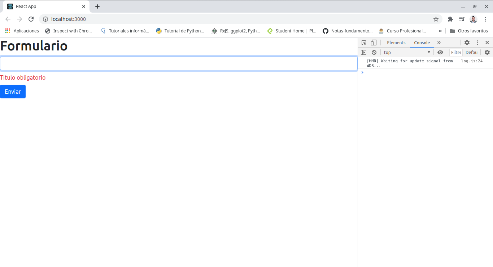

# React-Hooks-

## Tabla de contenido 

[Fundamentos Reactjs](#Fundamentos-Reactjs)

[JSX y Recorrer Arrays con Keys](#JSX-y-Recorrer-Arrays-con-Keys)

[Formularios onChange y onSubmit](#Formularios-onChange-y-onSubmit)

[React Hook Form](#React-Hook-Form)

[]()

[]()

[]()

[]()

[]()

[]()

[]()

[]()

[]()

[]()

[]()

[]()

[]()

<div align="right">
  <small><a href="#tabla-de-contenido">🡡 volver al inicio</a></small>
</div>

## Fundamentos Reactjs


Para empezar a manejar React Hooks es necesario tener fundamentos de JavaScript.

Los Hooks son una nueva incroporacion en React 16.8. Permiten usar estado y otras caracteristicas de React sin escribior una clase.

Es necesario tener instalado [nodejs](https://nodejs.org/es/) en su version actual o en la version LTS, es necesario instalarlo para hacer uso de **npm** que es el programa que ayuda a instalar dependencias

A continuacion para empezar el proyecto se debe abrir la terminal y abrir la ubicacion donde se va a instalar el proyecto por ejemplo esa carpeta se puede llamar proyectos React Hooks o el nombre que se desee en mi caso se llama React Hooks


A continuacion ejecutar en la terminal el comando `npx create-react-app my-app` en este caso **my-app** va a ser el nombre de la aplicacion o proyecto que se vaya a realizar y dentro de la carpeta **my-app** se van a crear todas las dependencias del proyecto.

En lo posible es mejor usar un editor de codigo como [Visual Studio Code](https://code.visualstudio.com/).

Despues de realizar la instalacion nuevamente en la terminal abrir la ubicacion del proyecto que en este caso la nueva ruta es con la carpeta que se creo que es **my-app** y ejecutar el comando `code .` para abrir Visual Studio Code con las dependencias del proyecto


En la terminal ejecutar `npm start`, este comando lo que va a hacer es abrir un servidor en el navegador con el componente de react funcionando y girando sobre si mismo 


Los componentes son codigo de html y javascript, pero que se encuentran separados por ejemplo en la imagen a continuacion cada componente representa un color distinto


En Visual Studio Code al abrir la carpeta instalada **my-app**, se encuentra varios archivos y carpetas 


Dentro de la carpeta **node_modules** estan los modulos de node que sirven para ejecutar todo el codigo

**public** es la carpeta donde estan los archivos publicos que estan en el componente. Por ejemplo esta el archivo **index.html** donde esta tan solo una parte de lo que queremos que vea el cliente.

Lo mas importante del archivo index.html es lo que esta en el div con id root, dentro del div es donde van a estar todos los componentes y funcionalidad que se le quiera dar a la aplicacion creada 


**src**(source) Donde estan todos los archivos que se van a trabajar para crear los componentes, el archivo **.gitignore** sirve para que cuando se vaya a subir un proyecto no suban algunos archivos que no queremos mostrar.

Uno de los archivos mas importantes que esta dentro de la carpeta **src** es **App.js** donde estan importados algunos archivos y librerias y ademas en este hay funciones de JavaScript y codigo html


El renderizado por ejemplo del icono que se muestra cuando ejecutamos **npm start** es el icono de React que es un atomo. y este se esta representado entre llaves `{logo}`

Pero esto es solo un ejemplo que trae consigo el framework, para empezar a utilizarlo la estructura de **App.js** va a quedar de la siguiente forma

```
import React from 'react';

function App() {
  return (
    <div >

    </div>
  );
}

export default App;

```

Dentro del `<div></div>` agregar el primer Hola mundo React en una etiqueta h1

```
import React from 'react';

function App() {
  return (
    <div >
      <h1>Hola mundo React</h1>
    </div>
  );
}

export default App;

```

El servidor esta pendiente de cada cambio que se esta realizando mientras se este ejecutando en la terminal por tanto al revisar en navegador se va a desplegar **Hola mundo React** como se escribio en el archivo


Las extensiones que se pueden instalar en Visual Studio Code son las siguientes:

- [Bracket Pair Colorizer](https://marketplace.visualstudio.com/items?itemName=CoenraadS.bracket-pair-colorizer)

- [ES7 React/Redux/React-Native/JS snippets](https://marketplace.visualstudio.com/items?itemName=dsznajder.es7-react-js-snippets)

- [generate-react-component](https://marketplace.visualstudio.com/items?itemName=joshjg.generate-react-component)

- [Prettier Formatter](https://marketplace.visualstudio.com/items?itemName=esbenp.prettier-vscode)

- [React/Redux/react-router Snippets](https://marketplace.visualstudio.com/items?itemName=discountry.react-redux-react-router-snippets)

- [Reactjs snippets](https://marketplace.visualstudio.com/items?itemName=xabikos.ReactSnippets)

- [Simple React Snippets](https://marketplace.visualstudio.com/items?itemName=burkeholland.simple-react-snippets)

Estos sirven para facilitar el manejo del codigo, mostrar errores con colores, sugerencias, autocompletado con comandos, etc.

Por el momento se pueden borar unos archivos que no se estan ocupando en el proyecto como por ejemplo App.css, logo.svg. 

A continuacion dentro de la carpeta **src** crear una subcarpeta que tenga por nombre **components** la cual sera donde se van a crear cada uno de los componentes del proyecto, la carpeta se puede llamar de cualquier otra forma, pero el Framework sugiere que se llame de esta forma.

Dentro de esta carpeta crear un archivo que se llame **Contador.js** y se debe notar que los componentes la primer letra del archivo en mayuscula.

Dentro del archivo escribir **imr** que es la abreviacion de `import React from 'react'` y presionar con la tecla tab del teclado para que se autocomplete, esto solo va a suceder si se instalaron las extensiones anteriormente sugeridas.

**Nota:** cada vez que se cree un componente se debe importar react

si se escribe la abreviacion **sfc** va a traer la estructura de la funcion que debe llevar el archivo y ahora escribir **Contador**


Dentro del return agregar un `<h3>` y entre sus etiquetas html escribir Mi primer componente

```
import React from 'react'

const Contador = () => {
    return ( 
        <h3>Mi primer componente</h3>
     );
}
 
export default Contador;
```

Para llamar al componente se debe utilizar en el archivo **App.js** y se debe importar con el nobre del archivo y la ubicacion `import Contador from './components/Contador'`

para utilizar el componente se debe traer como una especie de html dentro del return asi `<Contador />`

```
import React from 'react';
import Contador from './components/Contador'

function App() {
  return (
    <div >
      <h1>Hola mundo React</h1>
      <Contador/>
    </div>
  );
}

export default App;

```

Visualizar nuevamente el navegador y a continuacion se ve el componente funcionando


A partir de este momento se va a empezar a hacer uso de los Hooks. Que permiten usar estados y otras caracterisiticas de React sin escribir una clase.

El estado son datos que se pueden manipular, para hacer uso del estado importandolo con react entre llaves {useState}.

En el componente Contador se va hacer uso del estado para eso se importa `import React, {useState} from 'react'`

Ahora antes del `return` va a estar toda la logica que se requiera hacer para la aplicacion y dentro de este se va hacer uso del estado

para esto se crea una constante que se hace = al useState y tambien otra que se llame Contador que va a contener un Arrow Function.

Lo que va dentro de las llaves cuadradas [] es el nombre del estado y luego se coloca generalmente set y el nombre del estado, este servira para modificar en este ejemplo el numero

Dentro de los parentesis del `useState()` se va a dar el valor inicial del estado, el cual puede recibir cualquier tipo de dato, como un numero, un booleano, un array, un objeto, etc.

```
import React, {useState} from 'react'

const Contador = () => {

    const [numero, setNumero] = useState(0);

    return ( 
        <h3>Mi primer componente</h3>
     );
}
 
export default Contador;
```

para llamar el estado en este caso, o cualquier valor que venga de javascript se coloca el nombre entre corchetes `{numero}`

```
import React, {useState} from 'react'

const Contador = () => {

    const [numero, setNumero] = useState(1);

    return ( 
        <h3>Mi {numero}} componente</h3>
     );
}
 
export default Contador;
```

Automaticamente este se va a renderizar en el navegador


y si se coloca un string en el state tambien se va a renderizar en el navegador 

```
import React, {useState} from 'react'

const Contador = () => {

    const [numero, setNumero] = useState('primer');

    return ( 
        <h3>Mi {numero} componente</h3>
     );
}
 
export default Contador;
```


`setNumero` va a servir para modificar el estado. El ejemplo sera que un usuario haga click sobre un boton y los numeros empiecen a cambiar, presiona 0, presiona 1, presiona 2, etc.

para esto devajo del h3 se crea una etiqueta de boton que se llame Aumentar 

```
import React, {useState} from 'react'

const Contador = () => {

    const [numero, setNumero] = useState('primer');

    return ( 
        <h3>Mi {numero} componente</h3>
        <buttton>Aumentar<button>
     );
}
 
export default Contador;
```

Al renderizar esto, la pagina muestra un error


y es porque react tiene la filosofia de renderizar un solo componente, para que no ocurra un error la etiqueta h3 y button se debe envolver en un div padre 

```
import React, {useState} from 'react'

const Contador = () => {

    const [numero, setNumero] = useState('primer');

    return ( 
        <div>
            <h3>Mi {numero} componente</h3>
            <button>Aumentar</button>
        </div>
     );
}
 
export default Contador;
```

De esta forma ya se va a renderizar el componente en el navegador


Existe otra alternativa a usar diferente al div y se llama `Fragment`, este se debe importar junto con useState entre corchetes `{useState, Fragment}` y posteriormente se reemplazan en este caso por los `div`

```
import React, {useState, Fragment} from 'react'

const Contador = () => {

    const [numero, setNumero] = useState('primer');

    return ( 
        <Fragment>
            <h3>Mi {numero} componente</h3>
            <button>Aumentar</button>
        </Fragment>
     );
}
 
export default Contador;
```

De esta forma se va a seguir renderizando de la misma forma


Ahora se va a dar funcionalidad al boton con un `onclick={}` el cual al escuchar el click va a empezar aumentar de 1 en 1, lo que va dentro de los corchetes sera una funcion o lo que se desee.

La funcion se va a crear con una constante que se va a llamar aumentar y esta va a contener un Arrow Function 

```
import React, {useState, Fragment} from 'react'

const Contador = () => {

    const [numero, setNumero] = useState('primer');

    const aumentar = () => {
        
    }

    return ( 
        <Fragment>
            <h3>Mi {numero} componente</h3>
            <button onClick={ }>Aumentar</button>
        </Fragment>
     );
}
 
export default Contador;
```

y ahora para ver como esta funcionando se puede hacer un `console.log(Estoy haciendo click)` y agregar la funcion al `onClick={aumentar}`.

```
import React, {useState, Fragment} from 'react'

const Contador = () => {

    const [numero, setNumero] = useState('primer');

    const aumentar = () => {
        console.log('Estoy haciendo click')
    }

    return ( 
        <Fragment>
            <h3>Mi {numero} componente</h3>
            <button onClick={ aumentar }>Aumentar</button>
        </Fragment>
     );
}
 
export default Contador;
```

Para poder ver que este funcionando dar click derecho sobre el navegador, hacer click donde diga inspeccionar elemento y ubicarse en la pestaña consola o tambien se puede usar con el teclado **Ctrl + shift + j** despues de tener abierta la consola, hacer click varias veces sobre el boton aumentar y como se observa en el costado derecho de la pantalla aparece que di click 11 veces


Para añadir funcionalidad ahora si se agrega setNumero para empezar a cambiar de 1 en 1, si se coloca `numero +1`, por si solo el navegador va a arrojar un error porque para eso recomienda hacer uso de en este caso el metodo o la funcion que va a hacer el cambio de estado `setNumero(numero +1)`

```
import React, {useState, Fragment} from 'react'

const Contador = () => {

    const [numero, setNumero] = useState(0);

    const aumentar = () => {
        console.log('Estoy haciendo click')
        setNumero(numero +1);
    }

    return ( 
        <Fragment>
            <h3>Mi {numero} componente</h3>
            <button onClick={ aumentar }>Aumentar</button>
        </Fragment>
     );
}
 
export default Contador;
```


<div align="right">
  <small><a href="#tabla-de-contenido">🡡 volver al inicio</a></small>
</div>

## JSX y Recorrer Arrays con Keys

**JSX**

La presentacion del siguiente bloque de codigo no se que conoce como un string o un html

`const element = <h1>Hello, world!</h1>;`

Se llama JSX y es una extension de la sintaxis de JavaSscript el cual es lo recomendable para usar con React para describir como deberia ser la interfaz de usuario. JSX puede recordar a un lenguaje de plantilla, pero viene con JavaScript.

A continuacion se van a modificar los elementos del capitulo pasado.

En la carpeta components crear un archivo llamado **Jsx.js** y dentro de este archivo hacer la construccion basica del componente

```
import React from 'react'

const Jsx = () => {
    return (  );
}
 
export default Jsx;
```

Dentro de la estructura de este podemos hacer una condicion con un if ternario para esto pintamos un h2 preguntando Frio o Calor  en h4 la condicion `temperatura > 20 ? 'Calor' : 'Frio`, esta expresion esta preguntando. Si la temperatura es mayor a 20 entonces imprima Calor si es verdadera la condicion de lo contrario es decir si es menos imprima Frio. Y todo esto de cumple dada una condicion que la agregamos antes del return creando una constante que se llama temperatura

**Nota:** Recordar que como React trabaja con los componentes y para tener toda su estructura debe estar dentro de Fragment importandolo con la libreria o usar contenedores div

```
import React, {Fragment}from 'react'

const Jsx = () => {

    const temperatura = 21;

    return ( 
        <Fragment>
        <h2>Frio o Calor?</h2>
        <h4>
            {
                temperatura > 20 ? 'Calor' : 'Frio'
            }
        </h4>
        </Fragment>
     );
}
 
export default Jsx;
```

Para hacer uso del componente ahora pasamos a **App.js**, y lo importamos para luego imprimirlo en el navegador. En este capitulo ya no vamos a hacer uso del componente Contador, motivo por el cual no se presenta en este documento

```
import React from 'react';
import Jsx from './components/Jsx'

function App() {
  return (
    <div >
      <Jsx/>
    </div>
  );
}

export default App;

```

Recordando que la condicion es mayor a 20 entonces en el navegador debe aparecer la palabra Calor 


A continuacion vamos a crear un nuevo componente el cual se llamara **Lista.js** la cual se utilizara para crear un arreglo y recorrerlo haciendo uso de useState. Recordando que se establece la estructura basica utilizando abreviaciones como **imr** y **sfc** para autocomplentar esta sintaxis

```
import React from 'react'

const  = () => {
    return (  );
}
 
export default ;
```

A continuacion hacemos el llamado de useState y de fragment para poder usar cada uno de ellos en sus respectivos sitios.

creamos una constante donde el estado se llama arrayNumero, y el modificador setArrayNumero y su estado se inicializa con un array que recibe numeros, los cuales cuando usemos el metodo map, cada uno de estos numeros se van a representar como un item.

Despues para nombrar este ejercicio encerramos la palabra Lista dentro de un h2 y a continuacion utilizamos el estado para recorrerlo con el metodo map y despues retornarlo en una lista entre etiquetas de parrafo

```
import React, {useState, Fragment} from 'react'

const Lista = () => {

    const [arrayNumero, setArrayNumero] = useState([1, 2, 3, 4, 5, 6]);

    return ( 
        <Fragment>
        <h2>Lista</h2>
        {
            arrayNumero.map((item) => 
            <p>{item}</p>)
        }
        </Fragment>
     );
}
 
export default Lista;
```

Ahora lo importamos dentro del archivo **App.js** y lo utilizamos como otro componente debajo de Jsx

```
import React from 'react';
import Jsx from './components/Jsx'
import Lista from './components/Lista'

function App() {
  return (
    <div >
      <Jsx/>
      <Lista/>
    </div>
  );
}

export default App;

```

De esta forma visualizamos en el navegador ambos componentes y el recorrido que hizo el metodo map implementado en el componente de Lista


Al abrir la consola con **ctrl + shift +j**, esta informando sobre un error que al usar el metodo map esta obligado a pasar un segundo parametro que acompaña a cada numero del recorrido el cual es 0 y se va a representar como index.

Ademas de esto antes de cerrar la primer etiqueta p se debe llamar el atributo key y pasar como parametro a index tambien.

De esta forma, si en vez de empezar en 1, el array comenzara en 0 se imprimirian valores como (0,0, 1,1, 2,2, 3,3, 4,4, 5,5, 6,6)

Cuando lo visualicen en el navegador lo van a comprender mejor

```
import React, {useState, Fragment} from 'react'

const Lista = () => {

    const [arrayNumero, setArrayNumero] = useState([1, 2, 3, 4, 5, 6]);

    return ( 
        <Fragment>
        <h2>Lista</h2>
        {
            arrayNumero.map((item, index) => 
            <p key={index}>{item} - {index}</p>)
        }
        </Fragment>
     );
}
 
export default Lista;
```


Lo unico que se ve ahora del lado derecho, en la consola es una advertencia que indica que no se esta haciendo uso de setArrayNumero

A continuacion vamos a hacer uso del modificador pero antes de eso vamos a añadir un evento onClick en un boton que vamos a crear debajo de la lista y se va a llevar por nombre la palabra agregar elemento

```
import React, {useState, Fragment} from 'react'

const Lista = () => {

    const [arrayNumero, setArrayNumero] = useState([1, 2, 3, 4, 5, 6]);

    return ( 
        <Fragment>
        <h2>Lista</h2>
        <button onClick={agregarElemento} >Agregar elemento</button>
        {
            arrayNumero.map((item, index) => 
            <p key={index}>{item} - {index}</p>)
        }
        </Fragment>
     );
}
 
export default Lista;
```

Si se deja de esta forma por el momento el navegador mostrara un error porque no se esta haciendo nada con el evento que se esta declarando que es el que esta entre `{agregarElemento}`


Para dejar de ver esto error hay que agregar funcionalidad mediante una constante que se llame agregar elemento y se pase un arrow function que escuche el evento.

A continuacion como se va a dar uso del modificador se debe tener en cuenta que el estado inicial se declaro como un array, por tal motivo el modificador tambien debe ser un array que en un principio va a recibir el numero 7

```
import React, {useState, Fragment} from 'react'

const Lista = () => {

    const [arrayNumero, setArrayNumero] = useState([1, 2, 3, 4, 5, 6]);

    const agregarElemento = () => {
        console.log('click')
        setArrayNumero([7])
    }

    return ( 
        <Fragment>
        <h2>Lista</h2>
        <button onClick={agregarElemento} >Agregar elemento</button>
        {
            arrayNumero.map((item, index) => 
            <p key={index}>{item} - {index}</p>)
        }
        </Fragment>
     );
}
 
export default Lista;
```

El navegador se va a presentar con la lista de arreglos a continuacion


pero al dar click sobre el boton agregar elemento esta lista cambio por 7,0. y entonces lo que sucede es que se pierde el estado inicial que es la lista


para corregir este error se va a hacer uso del operador de propagacion **(...)**, el cual esta representado por 3 puntos, este operador sirve en este caso para concatenar 2 arreglos como el ejemplo a continuacion

`const a = [1,2,3]`
`const b = [4,5,6]`

para declararlos de una manera mas simple se crea una constante c de esta forma y se concatena todo en un solo array

`const c = [...a, ...b]`

`console.log(c)`


Continuando con el ejemplo y habiendo visto el concepto del operador de propagacion se va a hacer uso de este para concatenarlo con el numero 7 y presentarlo debajo del resto de la lista al hacer click sobre el boton Agregar elemento

```
import React, {useState, Fragment} from 'react'

const Lista = () => {

    const [arrayNumero, setArrayNumero] = useState([1, 2, 3, 4, 5, 6]);

    const agregarElemento = () => {
        console.log('click')
        setArrayNumero([
            ...arrayNumero,
            7
        ])
    }

    return ( 
        <Fragment>
        <h2>Lista</h2>
        <button onClick={agregarElemento} >Agregar elemento</button>
        {
            arrayNumero.map((item, index) => 
            <p key={index}>{item} - {index}</p>)
        }
        </Fragment>
     );
}
 
export default Lista;

```

y como resultado obtenemos primero la lista normal


Despues hacemos click y obtenemos debajo el 7


y si seguimnos dando click sobre el boton va a continuar imprimiendose el 7 pero cambiando su llave


A continuacion ahora la funcion se va a volver mas dinamica para imprimir o continuar con el resto de numeros despues del 7

para esto se va a crear un nuevo estado que va a recibir a numero y a setNumero y como el numero con el que queremos continuar dinamicamente lo vamos a inicializar con el numero 7 y lo llamamos en la funcion agregarElemento para poderlo usar e imprimirlo como el estado

```
import React, {useState, Fragment} from 'react'

const Lista = () => {

    const [arrayNumero, setArrayNumero] = useState([1, 2, 3, 4, 5, 6]);

    const [numero, setNumero] = useState(7)

    const agregarElemento = () => {

        setNumero(numero + 1)

        setArrayNumero([
            ...arrayNumero,
            numero
        ])
    }

    return ( 
        <Fragment>
        <h2>Lista</h2>
        <button onClick={agregarElemento} >Agregar elemento</button>
        {
            arrayNumero.map((item, index) => 
            <p key={index}>{item} - {index}</p>)
        }
        </Fragment>
     );
}
 
export default Lista;

```

Nuevamente revisamos el navegador y tenemos una lista inicial


y con el boton agregar elemento continuamos imprimendo numeros distintos


<div align="right">
  <small><a href="#tabla-de-contenido">🡡 volver al inicio</a></small>
</div>

## Formularios onChange y onSubmit

En este capitulo veremos lo que son los Formularios.

Nuevamente dentro de la carpeta components crear un archivo que se llame **Formulario.js** y construir la estructura basica con los comando **imr** y **sfc**

```
import React from 'react'

const Formulario = () => {
    return (  );
}
 
export default Formulario;
```

dentro del return crear una etiqueta h1 que lleve por nombre Formulario.

A continuacion pasar a **App.js** y ya no se van a utilzar los archivos de la clase anterior entonces solamente importamos lo que necesitamos, que es el componente de Formulario

```
import React from 'react';
import Formulario from './components/Formulario'


function App() {
  return (
    <div >
      <Formulario/>
    </div>
  );
}

export default App;

```

y obtenemos el render en el navegador del componente Formulario


Para este capitulo se va hacer uso de [Bootstrap](https://getbootstrap.com/). Si no hay conocimiento de este pueden ver videos para aprender en el siguiente [enlace](https://www.youtube.com/watch?v=z7ecV0tL1Gg&ab_channel=Bluuweb%21).

Lo que se hace es importar el cdn que se encuentra en la pagina de Bootstrap y a continuacion, abrir la carpeta **public** del proyecto y copiar este cdn en el archivo **index.html** como se muestra en la imagen a continuacion 

```
<link href="https://cdn.jsdelivr.net/npm/bootstrap@5.0.0-beta1/dist/css/bootstrap.min.css" rel="stylesheet" integrity="sha384-giJF6kkoqNQ00vy+HMDP7azOuL0xtbfIcaT9wjKHr8RbDVddVHyTfAAsrekwKmP1" crossorigin="anonymous">
```


Al guardar los cambios ya se obtendra un cambio en los estilos del navegador y el titulo de Formulario se presentara de una manera distinta


para empezar a obtener otro tipo de cambios se agregan clases a las etiquetas con el keyword `className`. si estuviera trabajando con html puro se usaria el keyword `class`, y esto es una de las diferencias que proporciona React. Para centrar mas el contenido y tener un margen top de 5, escribimos a continuacion de la etiqueta div del archivo **App.js** las propiedades del contenedor con un `className="container mt-5"`

```
import React from 'react';
import Formulario from './components/Formulario'


function App() {
  return (
    <div className="container mt-5" >
      <Formulario/>
    </div>
  );
}

export default App;

```

Para empezar a trabajar con el componente nuevamente abrimos el archivo **Formulario.js**, importamos `{Fragment, useState}` y a continuacion de la etiqueta h1 agregamos una etiqueta Form y despues los input

```
import React, {Fragment, useState} from 'react'

const Formulario = () => {
    return ( 
        <Fragment>
            <h1>Formulario</h1>
            <form className="row">
                <div className="col-md-3">
                    <input
                        placeholder="Ingrese nombre">
                    </input>
                </div>
                <div className="col-md-3">
                    <input
                        placeholder="Ingrese apellido"></input>
                </div>
                <div className="col-md-3">
                    <button>Enviar</button>
                </div>
            </form>
        </Fragment>
     );
}
 
export default Formulario;
```

De momento el render en el navegador se ve de la siguiente forma y esto obliga a que se debe mejorar el diseño y hacer uso de los estilos de Bootstrap


A continuacion se agregan las clases al formulario a los input y al boton para que se presenten de una forma visual mas agradable

```
import React, {Fragment, useState} from 'react'

const Formulario = () => {
    return ( 
        <Fragment>
            <h1>Formulario</h1>
            <form className="row">
                <div className="col-md-3">
                    <input
                        placeholder="Ingrese nombre"
                        className="form-control"
                        type="text">
                    </input>
                </div>
                <div className="col-md-3">
                    <input
                        placeholder="Ingrese apellido"
                        className="form-control"
                        type="text">
                    </input>
                </div>
                <div className="col-md-3">
                    <button className="btn btn-primary" type="submit">Enviar</button>
                </div>
            </form>
        </Fragment>
     );
}
 
export default Formulario;
```


Ahora cada input se va a relacionar con algun Hook y para eso vamos a hacer uso de useState antes del return y creamos el estado el cual se va a llamar datos y su modificador sera setDatos y el estado se va a inicializar con un objeto `{}` el cual se va a inicializar con un nombre y un apellido vacio

```
{
  nombre : '',
  apellido: '',
}
```

Ahora se debe relacionar cada uno de los input con cada objeto por tal motivo es recomendable que en los input se agregue el atributo name y tengan los mismos nombres de estos objetos como se ve a continuacion

```
import React, {Fragment, useState} from 'react'

const Formulario = () => {

    const [datos, setDatos] = useState({
        nombre: '',
        apellido: '',
    })

    return ( 
        <Fragment>
            <h1>Formulario</h1>
            <form className="row">
                <div className="col-md-3">
                    <input
                        placeholder="Ingrese nombre"
                        className="form-control"
                        type="text"
                        name="nombre">
                    </input>
                </div>
                <div className="col-md-3">
                    <input
                        placeholder="Ingrese apellido"
                        className="form-control"
                        type="text"
                        name="apellido">
                    </input>
                </div>
                <div className="col-md-3">
                    <button className="btn btn-primary" type="submit">Enviar</button>
                </div>
            </form>
        </Fragment>
     );
}
 
export default Formulario;
```

**Nota:** El escribir los mismos nombres que tiene el objeto en los atributos de cada input no significa que esten conectados de alguna forma, pero es uno de los primeros pasos a establecer y sirve para que mas adelante se vea la funcionalidad de esto

___

Al utilizar google Chrome hay una herramienta de los devTools que se llama Components y de esta forma se pueden ver los componentes de nuestra aplicacion en el navegador, para instalarlo pueden seguir al siguiente [enlace](https://chrome.google.com/webstore/detail/react-developer-tools/fmkadmapgofadopljbjfkapdkoienihi?hl=es).


Ahora se va hacer uso del evento **onChange** que va a estar en los atributos del input, el cual estara pendiente de los cambios que se vayan registrando y dentro de este va a tener una funcion la cual se puede llamar de cualquier forma pero para esta ocasion se llamara handleInputChange `onChange={handleInputChange}` y ahora se debe crear la funcion en la parte del JavaScript el cual ira de la siguiente forma

`const handleInputChange = () => {}}`, como esta es una funcion que esta a la escucha de un evento entre los parentesis se coloca la palabra event o la que se considere conveniente, esto se hace por que es una convencion del lenguaje.

Dentro de este evento se va a agregar un console.log que dice Funciona!

```
import React, {Fragment, useState} from 'react'

const Formulario = () => {

    const [datos, setDatos] = useState({
        nombre: '',
        apellido: '',
    })

    const handleInputChange = (event) => {
        console.log("Funciona!")
    }

    return ( 
        <Fragment>
            <h1>Formulario</h1>
            <form className="row">
                <div className="col-md-3">
                    <input
                        placeholder="Ingrese nombre"
                        className="form-control"
                        type="text"
                        name="nombre"
                        onChange={handleInputChange}>
                    </input>
                </div>
                <div className="col-md-3">
                    <input
                        placeholder="Ingrese apellido"
                        className="form-control"
                        type="text"
                        name="apellido"
                        onChange={handleInputChange}>
                    </input>
                </div>
                <div className="col-md-3">
                    <button className="btn btn-primary" type="submit">Enviar</button>
                </div>
            </form>
        </Fragment>
     );
}
 
export default Formulario;
```

Ahora al guardar los cambios verificar la consola del navegador y escribir algo sobre los campos de ambos formularios para verificar como en la consola se esta imprimiendo con cada letra que colocamos la palabra Funciona!


Ahora en el console.log cambiar `"Funciona!"` por `event.target.value` el cual va a detectar el valor que coloquemos en cada input

**Nota:** si en vez de haber pasado la palabra event como parametro pasaron otra por ejemplo `pepito` entonces colocar `pepito.target.value`

y como se ve a continuacion cada letra escrita la esta tomando esta propiedad


Ahora hay que hacer uso del modificador setDatos y a continuacion del console.log se establece setDatos. Se debe tener en cuenta que el operador de propagacion **...**, hace una copia de los datos y concatena. Entonces utilzamos junto con este operador la propiedad para establecer el nombre y el apellido, en este momento es cuando se relaciona el atributo name que se le dio a cada input y que es igual a los nombres que contiene el objeto del valor inicial del estado

```
        setDatos({
            ...datos,
            [event.target.name] : event.target.value
        }
```

```
import React, {Fragment, useState} from 'react'

const Formulario = () => {

    const [datos, setDatos] = useState({
        nombre: '',
        apellido: '',
    })

    const handleInputChange = (event) => {
        console.log(event.target.value)
        setDatos({
            ...datos,
            [event.target.name] : event.target.value
        }
        )
    }

    return ( 
        <Fragment>
            <h1>Formulario</h1>
            <form className="row">
                <div className="col-md-3">
                    <input
                        placeholder="Ingrese nombre"
                        className="form-control"
                        type="text"
                        name="nombre"
                        onChange={handleInputChange}>
                    </input>
                </div>
                <div className="col-md-3">
                    <input
                        placeholder="Ingrese apellido"
                        className="form-control"
                        type="text"
                        name="apellido"
                        onChange={handleInputChange}>
                    </input>
                </div>
                <div className="col-md-3">
                    <button className="btn btn-primary" type="submit">Enviar</button>
                </div>
            </form>
        </Fragment>
     );
}
 
export default Formulario;
```

Ahora dirigir nuevamente a la pestaña de componentes de los devTools y desplegar en los hools el nombre y el apellido para ver como cada componente esta obteniendo el estado de lo que escribimos en los campos del nombre y el apellido


Si se quiere imprimir el nobmre de otra forma tambien debajo del cierre de la etiqueta formse puede incluir una etiqueta h3 o de parrafo y llamar el nombre y el apellido entre `<h3>{datos.nombre} - {datos.apellido}</h3>`


Existe otro evento llamado onSubmit que ira directamente en el formulario y tendra una funcion llamada `enviarDatos`, la cual que se tiene que construir en la parte del javaScript, esta funcion tambien va a recibir como parametro a `event` y este hace uso de un metodo que se llama `preventDefault()` que es como hacer un Get para obtener los datos y ahorrar pasos que obtienen el procesamiento de manera automatica. Despues de esto se hace un console.log de `datos.nombre` y `datos.apellido`.

```
import React, {Fragment, useState} from 'react'

const Formulario = () => {

    const [datos, setDatos] = useState({
        nombre: '',
        apellido: '',
    })

    const handleInputChange = (event) => {
        // console.log(event.target.value)
        setDatos({
            ...datos,
            [event.target.name] : event.target.value
        }
        )
    }

    const enviarDatos = (event) => {
        event.preventDefault();
        console.log(datos.nombre + ' ' + datos.apellido)
    }

    return ( 
        <Fragment>
            <h1>Formulario</h1>
            <form className="row" onSubmit={enviarDatos}>
                <div className="col-md-3">
                    <input
                        placeholder="Ingrese nombre"
                        className="form-control"
                        type="text"
                        name="nombre"
                        onChange={handleInputChange}>
                    </input>
                </div>
                <div className="col-md-3">
                    <input
                        placeholder="Ingrese apellido"
                        className="form-control"
                        type="text"
                        name="apellido"
                        onChange={handleInputChange}>
                    </input>
                </div>
                <div className="col-md-3">
                    <button className="btn btn-primary" type="submit">Enviar</button>
                </div>
            </form>
            <h3>{datos.nombre} - {datos.apellido}</h3>
        </Fragment>
     );
}
 
export default Formulario;

```

Este evento ayuda a que cuando demos click sobre el boton enviar, la consola capture los datos que le ingresemos


<div align="right">
  <small><a href="#tabla-de-contenido">🡡 volver al inicio</a></small>
</div>

## React Hook Form

Esta es una extension que ayuda a realizar formularios de una manera mas sencilla y que se encuentra en el siguiente [enlace](https://react-hook-form.com/get-started), donde se puede seguir toda la documentacion 

En la parte donde dice comenzar ahora esta el comando para instalar esta extension en nuestro proyecto.


Recordar que se debe estar en la ubicacion del proyecto en la terminal y ejecutar el siguiente comando para realizar la instalacion

`npm install react-hook-form`

A continuacion crear un nuevo componente que conecte con **App.js**, el componente nombrarlo como **FormHook.js** y en **App.js** llamar solo al nuevo componente creado el cual queda asi 

```
import React, {Fragment} from 'react'

const FormHook = () => {
    return ( 
        <Fragment>
            <h1>Formulario</h1>
        </Fragment> 
     );
}
 
export default FormHook;
```

**App.js**

```
import React from 'react';
import FormHook from './components/FormHook'

function App() {
  return (
    <div>
      <FormHook/>
    </div>
  );
}

export default App;

```

Para empezar se va a generar un input y un boton de una forma sencilla en el archivo **FoormHook.js**, aprovechando que ya esta instalado el cdn de Bootstrap y generar unas clases para presentar visualmente el componente de una forma mas agradable

```
import React, {Fragment} from 'react'

const FormHook = () => {
    return ( 
        <Fragment>
            <h1>Formulario</h1>
            <form>
                <input
                name="titulo"
                className="form-control my-2"
                />
                <button className="btn btn-primary" >Enviar</button>
            </form>
        </Fragment> 
     );
}
 
export default FormHook;
```

al ejecutar npm start esto es lo que se debe ver en el navegador


Lo primero que se debe tener en cuenta para hacer uso de la libreria que proporciona los Hook Form es que se debe importar al componente `import {useForm} from 'react-hook-form'`, esta libreria servira para realizar valicaciones y va hacer uso de un registro, un error y la funcion que sera handleSubmit `const {register, errors, handleSubmit} = useForm();`

```
import React, {Fragment} from 'react'

import {useForm} from 'react-hook-form'


const FormHook = () => {
    const {register, errors, handleSubmit} = useForm();
    
    return ( 
        <Fragment>
            <h1>Formulario</h1>
            <form>
                <input
                name="titulo"
                className="form-control my-2"
                />
                <button className="btn btn-primary" >Enviar</button>
            </form>
        </Fragment> 
     );
}
 
export default FormHook;
```

La forma en que trabaja la funcion handleSubmit para hacer las validaciones es que se debe generar dentro de la etiqueta form un onSubmit que contenga a la funcion handleSubmit y que este nuevamenta haga uso de la funcion onSubmit `<form onSubmit={handleSubmit(onSubmit)}>`, nuevamente como en el capitulo anterior es muy importante tener el atributo name dentro de un input y por esta razon anteriormente ya se coloco este atributo name con el nombre de titulo.

Al realizar esto antes del return se puede crear una funcion onSubmit pasando como parametro data y luego hacer un console.log para ver que esta recibiendo la data

```
import React, {Fragment} from 'react'

import {useForm} from 'react-hook-form'


const FormHook = () => {
    const {register, errors, handleSubmit} = useForm();

    const onSubmit = (data) => {
        console.log(data)
    }

    return ( 
        <Fragment>
            <h1>Formulario</h1>
            <form onSubmit={handleSubmit(onSubmit)}>
                <input
                name="titulo"
                className="form-control my-2"
                />
                <button className="btn btn-primary" >Enviar</button>
            </form>
        </Fragment> 
     );
}
 
export default FormHook;
```

Ademas de esto dentro de los atributos se puede llamar a register para hacer todas las validaciones necesarias utilizandolo de esta forma

`ref = {register}`

en el register se pasa un objeto que reciba varios parametros como por ejemplo que el campo sea requerido utilizando `required: {value:true}` y tambien desplegar un mensaje de error sobre el campo si el usuario no pasa un valor de titulo, de esta forma queda asi 

```
ref={
    register({
        required: {value: true, message: 'Titulo obligatorio'}
    })
}
```

El archivo queda de esta forma

```
import React, {Fragment} from 'react'

import {useForm} from 'react-hook-form'


const FormHook = () => {
    const {register, errors, handleSubmit} = useForm();

    const onSubmit = (data) => {
        console.log(data)
    }

    return ( 
        <Fragment>
            <h1>Formulario</h1>
            <form onSubmit={handleSubmit(onSubmit)}>
                <input
                name="titulo"
                className="form-control my-2"
                ref={
                    register({
                        required: {value: true, message: 'Titulo obligatorio'}
                    })
                }
                />
                <button className="btn btn-primary" >Enviar</button>
            </form>
        </Fragment> 
     );
}
 
export default FormHook;
```

En el navegador se debe abrir la consola para observar que esta pasando, si se pasa al campo del titulo por ejemplo un nombre o cualquier palabra al hacer click al boton enviar, van a aparecer todos los datos que estamos pasando, esta es la importancia de las validaciones y el uso de los atributos como `name` y `ref`, se pueden pasar mas validaciones aqui una documentacion practica de [Bluuweb](https://bluuweb.github.io/react-udemy/04-formularios/#react-hook-form) para hacer uso de esta libreria


Para desplegar los errores se puede hacer uso de la etiqueta span con una clase bootstrap y hay 2 formas de hacer que esto se presente. usando Vanilla JavaScript o mediante los [Optional Chaining](https://developer.mozilla.org/es/docs/Web/JavaScript/Referencia/Operadores/Encadenamiento_opcional).

con esta expresion `{errors?.titulo?.message}` lo que se esta preguntando es. Existen errores (si/no), existen errores en el campo del titulo (si/no). si existe un error despliegue el mensaje que se registro con required

```
<span className="text-danger text-small d-block mb-2">
    {errors?.titulo?.message}
</span>
```

y el span se puede agregar debajo del input para desplegar el mensaje de error quedando de la siguiente forma

```
import React, {Fragment} from 'react'

import {useForm} from 'react-hook-form'


const FormHook = () => {
    const {register, errors, handleSubmit} = useForm();

    const onSubmit = (data) => {
        console.log(data)
    }

    return ( 
        <Fragment>
            <h1>Formulario</h1>
            <form onSubmit={handleSubmit(onSubmit)}>
                <input
                name="titulo"
                className="form-control my-2"
                ref={
                    register({
                        required: {value: true, message: 'Titulo obligatorio'}
                    })
                }
                />
                <span className="text-danger text-small d-block mb-2">
                    {errors?.titulo?.message}
                </span>
                <button className="btn btn-primary" >Enviar</button>
            </form>
        </Fragment> 
     );
}
 
export default FormHook;
```

Si a continuacion se abre el navegador y se da clic sobre el boton enviar nada va a aparecer el mensaje de error



Si existieran mas etiquetas input, tambien habria que agregar las respectivas validaciones para que al dar clic sobre el boton enviar tome toda la data.

Existe una propiedad adicional que sirve para limpiar los campos de los formularios es decir, actualmente se inserta una palabra sobre el campo pero no se limpia el formulario, toca borrar la palabra para insertar otra.

En la constante onSubmit se puede agregar un evento que permite realizarlo y asi es como se utiliza

```
const onSubmit = (data, e) => {
        console.log(data)
        e.target.reset()
    }
```

De tal forma que agregando esta nueva propiedad al codigo nuevamente en el navegador se inserta una palabra, se envia y se limpian los campos del formulario


Como se puede observar las palabras las recibio la consola pero no se quedaron sobre el campo para escribir